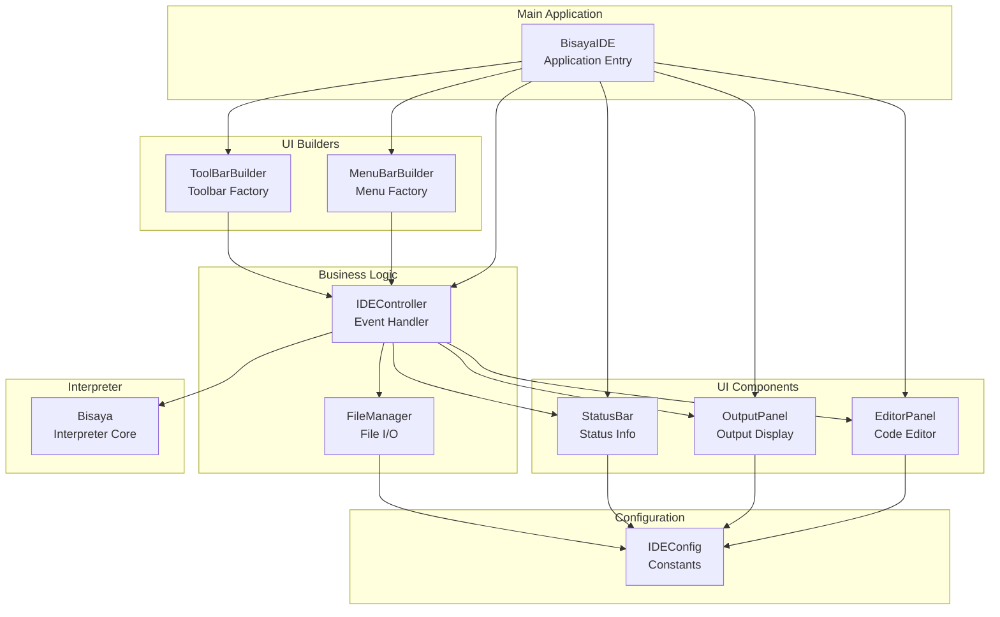
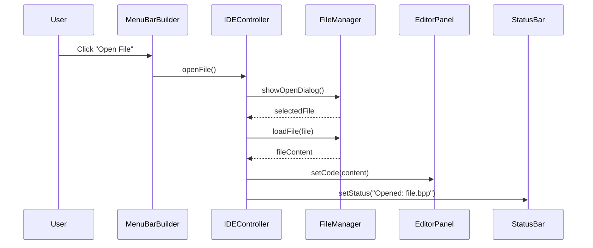
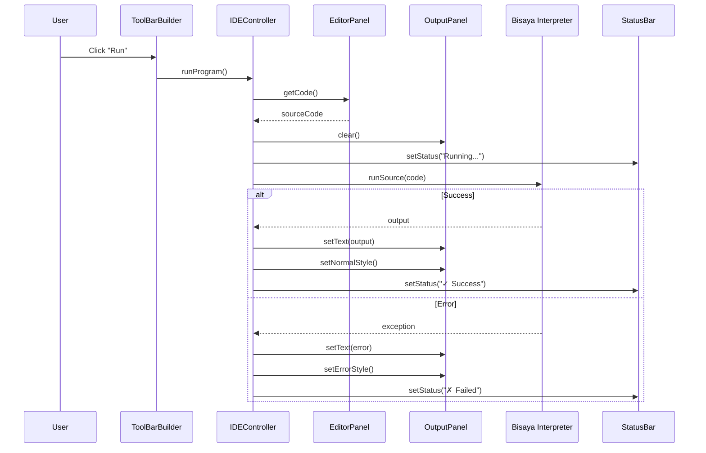
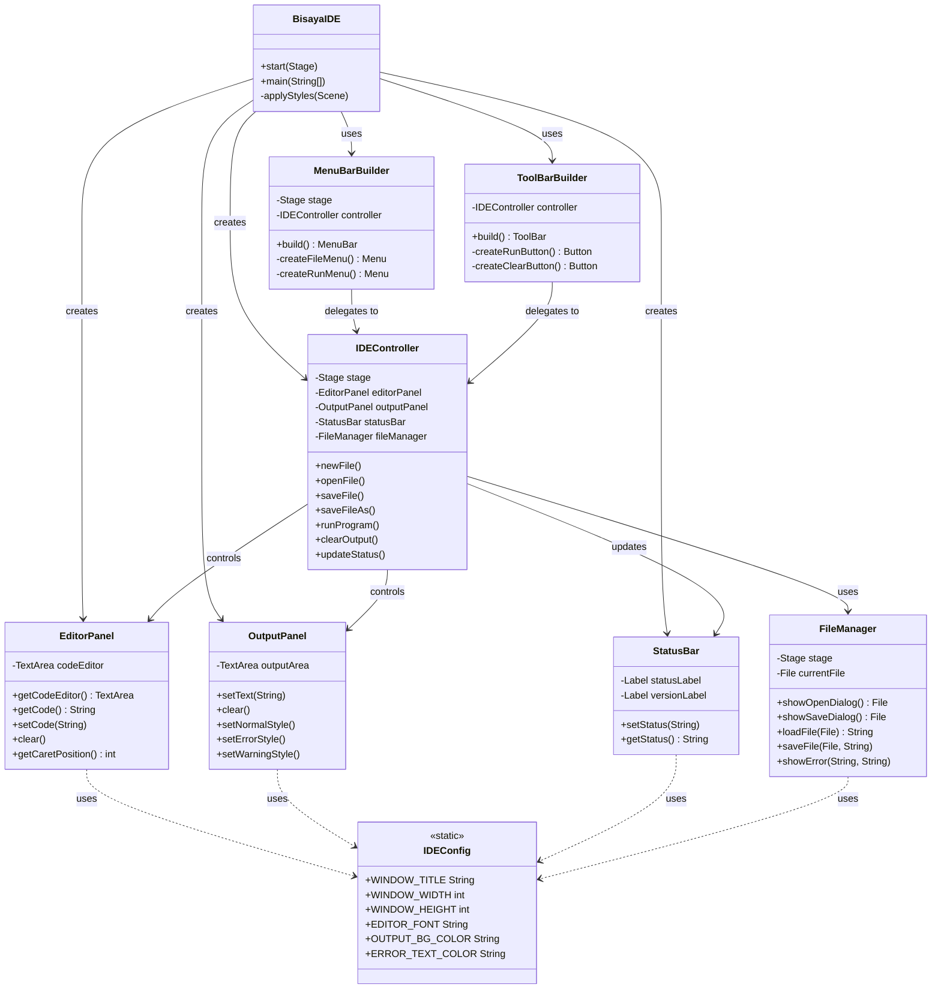
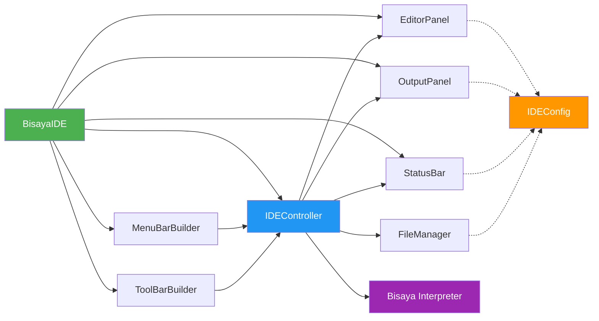

# Bisaya++ IDE Architecture

**Component Diagram and Class Relationships**

---

## System Architecture



---

## Component Interaction Flow

### File Operations


### Program Execution


---

## Class Diagram



---

## Dependency Graph



---

## Layered Architecture

```
┌─────────────────────────────────────────────────────┐
│              Presentation Layer                     │
│  (BisayaIDE, EditorPanel, OutputPanel, StatusBar)  │
└─────────────────────────────────────────────────────┘
                         ↓
┌─────────────────────────────────────────────────────┐
│              UI Builder Layer                       │
│        (MenuBarBuilder, ToolBarBuilder)             │
└─────────────────────────────────────────────────────┘
                         ↓
┌─────────────────────────────────────────────────────┐
│              Controller Layer                       │
│             (IDEController)                         │
└─────────────────────────────────────────────────────┘
                         ↓
┌─────────────────────────────────────────────────────┐
│              Service Layer                          │
│              (FileManager)                          │
└─────────────────────────────────────────────────────┘
                         ↓
┌─────────────────────────────────────────────────────┐
│              Core Layer                             │
│           (Bisaya Interpreter)                      │
└─────────────────────────────────────────────────────┘
                         ↓
┌─────────────────────────────────────────────────────┐
│              Configuration Layer                    │
│               (IDEConfig)                           │
└─────────────────────────────────────────────────────┘
```

---

## Data Flow

### User Input → Output
```
User Action
    ↓
MenuBarBuilder / ToolBarBuilder
    ↓
IDEController (Event Handler)
    ↓
EditorPanel / FileManager (Get Data)
    ↓
Bisaya Interpreter (Process)
    ↓
OutputPanel (Display Results)
    ↓
StatusBar (Update Status)
```

### Configuration Flow
```
IDEConfig (Static Constants)
    ↓
EditorPanel    OutputPanel    StatusBar    FileManager
    ↓               ↓              ↓            ↓
  (Applies fonts, colors, messages, paths)
```

---

## Responsibility Matrix

| Component | Responsibility | Depends On | Used By |
|-----------|---------------|------------|---------|
| **BisayaIDE** | Application entry, component assembly | All UI components | JavaFX runtime |
| **IDEController** | Business logic, event coordination | EditorPanel, OutputPanel, StatusBar, FileManager, Bisaya | Builders |
| **EditorPanel** | Code editor UI | IDEConfig | BisayaIDE, IDEController |
| **OutputPanel** | Output display UI | IDEConfig | BisayaIDE, IDEController |
| **StatusBar** | Status display UI | IDEConfig | BisayaIDE, IDEController |
| **MenuBarBuilder** | Menu creation | IDEController | BisayaIDE |
| **ToolBarBuilder** | Toolbar creation | IDEController | BisayaIDE |
| **FileManager** | File I/O operations | IDEConfig | IDEController |
| **IDEConfig** | Configuration constants | None | All UI components |

---

## Component Coupling

### Low Coupling
- **IDEConfig** → Used by all, depends on none
- **EditorPanel** → Self-contained UI component
- **OutputPanel** → Self-contained UI component
- **StatusBar** → Self-contained UI component

### Medium Coupling
- **FileManager** → Depends on Stage (for dialogs)
- **Builders** → Depend on IDEController

### High Coupling (Coordinator)
- **IDEController** → Central coordinator (by design)
- **BisayaIDE** → Main assembler (by design)

---

## Extension Points

### Adding New Features

**1. New Menu Item**
```java
// Modify MenuBarBuilder.createFileMenu()
MenuItem exportItem = new MenuItem("Export...");
exportItem.setOnAction(e -> controller.exportFile());
```

**2. New Panel**
```java
// Create new component
public class ConsolePanel extends VBox { ... }

// Wire in BisayaIDE
ConsolePanel consolePanel = new ConsolePanel();
splitPane.getItems().add(consolePanel);
```

**3. New Controller Action**
```java
// Add to IDEController
public void formatCode() {
    String code = editorPanel.getCode();
    String formatted = CodeFormatter.format(code);
    editorPanel.setCode(formatted);
}
```

---

## Testing Strategy

### Unit Tests (Per Component)
- ✅ IDEController logic methods
- ✅ FileManager I/O operations
- ✅ EditorPanel/OutputPanel API methods
- ✅ IDEConfig constant values

### Integration Tests
- ✅ BisayaIDE component assembly
- ✅ Controller ↔ Panel interactions
- ✅ Menu/Toolbar → Controller delegation

### UI Tests (TestFX)
- ✅ Button clicks trigger correct actions
- ✅ Menu items invoke controller methods
- ✅ File dialogs open correctly
- ✅ Editor/Output update as expected

---

## Summary

**Architecture Pattern**: MVC-like with UI Builders  
**Component Count**: 9 classes  
**Total Complexity**: Low (well-separated concerns)  
**Maintainability**: High (single responsibility)  
**Extensibility**: High (clear extension points)  
**Testability**: High (dependency injection)

---

**Document Version**: 1.0  
**Last Updated**: November 8, 2025  
**Status**: Active Architecture
