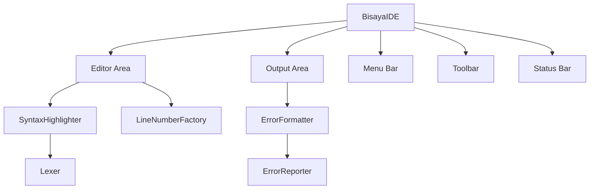
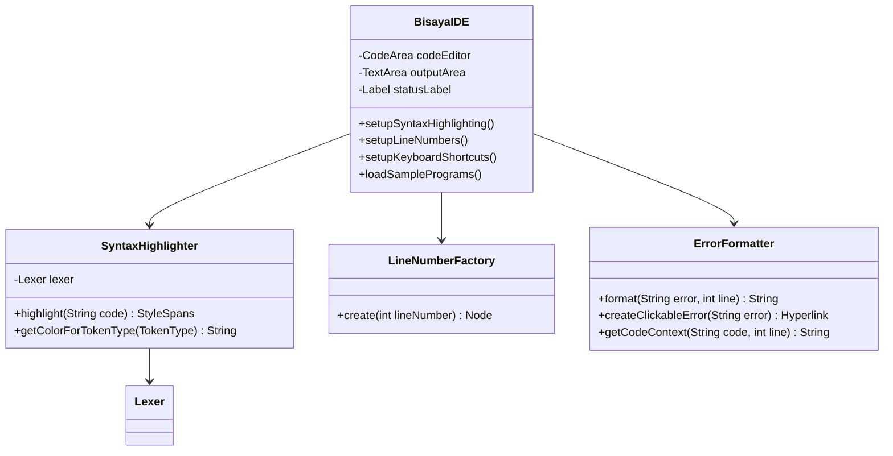

# Phase 2: Enhanced UX - Implementation Summary

**Status**: In Progress  
**Started**: November 8, 2025  
**Target Completion**: 2 weeks from Phase 1 completion  
**Priority**: Medium

---

## Overview

Phase 2 focuses on transforming the MVP GUI into a professional-looking IDE with syntax highlighting, line numbers, enhanced error formatting, and improved user experience features.

---

## Implementation Checklist

### Week 3: Visual Improvements

#### ✅ Syntax Highlighting
- [ ] Create `SyntaxHighlighter.java` component
- [ ] Integrate existing Lexer for token recognition
- [ ] Implement color scheme:
  - Keywords (SUGOD, KATAPUSAN, MUGNA, etc.) → Blue
  - Strings (double-quoted) → Green
  - Numbers (NUMERO, TIPIK literals) → Orange
  - Comments (@@) → Gray
  - Operators → Default/Dark gray
- [ ] Add debounced highlighting (300ms delay to avoid lag)
- [ ] Test with large programs (1000+ lines)

**Files to Create**:
- `app/src/main/java/com/bisayapp/ui/SyntaxHighlighter.java`

**Dependencies**:
- RichTextFX library (already in build.gradle)
- TokenType enum integration
- Lexer class integration

---

#### ✅ Line Numbers
- [ ] Create `LineNumberFactory.java` component
- [ ] Add line number column on left side
- [ ] Synchronize scrolling with editor
- [ ] Highlight current line (light yellow background)
- [ ] Update line numbers on text changes
- [ ] Handle wrap mode correctly

**Files to Create**:
- `app/src/main/java/com/bisayapp/ui/LineNumberFactory.java`

**Files to Modify**:
- `app/src/main/java/com/bisayapp/ui/BisayaIDE.java` - Integrate line numbers

---

#### ✅ UI Polish
- [ ] Add Clear Output button (toolbar)
- [ ] Implement dark/light theme toggle
- [ ] Add status bar at bottom
  - Line number display
  - Column number display
  - File status (saved/modified)
- [ ] Improve color scheme consistency
- [ ] Add toolbar icons for common actions

**Files to Modify**:
- `app/src/main/java/com/bisayapp/ui/BisayaIDE.java` - Add UI components
- Create CSS files for themes (optional)

**UI Components**:
- Clear Output Button → Below output area
- Theme Toggle → View menu
- Status Bar → Bottom of window (BorderPane.setBottom)

---

### Week 4: User Experience

#### ✅ Keyboard Shortcuts
- [ ] **Ctrl+R**: Run program
- [ ] **Ctrl+L**: Clear output
- [ ] **F5**: Reload file from disk
- [ ] **Ctrl+N**: New file
- [ ] **Ctrl+O**: Open file (already exists)
- [ ] **Ctrl+S**: Save file (already exists)
- [ ] **Ctrl+Shift+S**: Save As
- [ ] **Alt+F4**: Exit application

**Files to Modify**:
- `app/src/main/java/com/bisayapp/ui/BisayaIDE.java` - Add KeyCombination handlers

**Implementation**:
```java
scene.addEventFilter(KeyEvent.KEY_PRESSED, event -> {
    if (new KeyCodeCombination(KeyCode.R, KeyCombination.CONTROL_DOWN).match(event)) {
        runProgram();
        event.consume();
    }
    // ... other shortcuts
});
```

---

#### ✅ Sample Programs Menu
- [ ] Add "Examples" menu to menu bar
- [ ] Scan `/samples` folder for .bpp files
- [ ] Create menu items dynamically
- [ ] Load selected sample into editor
- [ ] Warn if current file has unsaved changes

**Files to Modify**:
- `app/src/main/java/com/bisayapp/ui/BisayaIDE.java` - Add Examples menu

**Sample Programs to Include**:
- Increment 1 samples (basic operations)
- Increment 2 samples (operators, DAWAT)
- Increment 3 samples (conditionals)
- Increment 4 samples (FOR loops)
- Increment 5 samples (WHILE loops)

**Menu Structure**:
```
Examples
  ├── Basic Operations
  │   ├── sample1.bpp
  │   └── sample2.bpp
  ├── Operators & Input
  │   └── ...
  ├── Conditionals
  │   └── ...
  └── Loops
      └── ...
```

---

#### ✅ Error Formatting
- [ ] Show line numbers in error messages
- [ ] Implement clickable errors (jump to error line)
- [ ] Better error message formatting (color, icons)
- [ ] Show code context around error (±2 lines)
- [ ] Categorize errors: Lexical, Syntax, Runtime

**Files to Create**:
- `app/src/main/java/com/bisayapp/ui/ErrorFormatter.java`

**Files to Modify**:
- `app/src/main/java/com/bisayapp/ui/BisayaIDE.java` - Handle error clicks
- `app/src/main/java/com/bisayapp/ErrorReporter.java` - Enhanced error context

**Error Display Format**:
```
[Line 5] Syntax Error: Expected ')' after expression
  4 | MUGNA NUMERO x = 10
> 5 | KUNG (x > 5
  6 | PUNDOK{
              ^
```

**Click Behavior**:
- Click on error → Jump to line and highlight
- Show error icon in line number gutter

---

## Technical Architecture

### Component Diagram


### Class Dependencies


---

## Implementation Sequence

### Step-by-Step Order

1. **Syntax Highlighting** (Days 1-2)
   - Most visible improvement
   - Builds on existing Lexer
   - Enables better code readability

2. **Line Numbers** (Day 3)
   - Quick to implement with RichTextFX
   - Essential for error navigation
   - Prepares for error line jumping

3. **Error Formatting** (Day 4)
   - Depends on line numbers
   - Improves debugging experience
   - Foundation for clickable errors

4. **Keyboard Shortcuts** (Day 5)
   - Enhances workflow efficiency
   - Simple to implement
   - High user satisfaction

5. **UI Polish** (Days 6-7)
   - Clear Output button
   - Status bar
   - Theme toggle (optional)

6. **Sample Programs Menu** (Days 8-9)
   - Requires file scanning
   - Dynamic menu generation
   - Improves demo experience

7. **Testing & Refinement** (Day 10)
   - Integration testing
   - Performance tuning
   - Bug fixes

---

## Testing Strategy

### Visual Tests
- [ ] Syntax highlighting renders correctly for all token types
- [ ] Line numbers match code lines
- [ ] Current line highlight visible
- [ ] Theme toggle works without breaking layout

### Functional Tests
- [ ] All keyboard shortcuts respond correctly
- [ ] Sample programs load without errors
- [ ] Error clicks navigate to correct line
- [ ] Clear output clears only output area

### Performance Tests
- [ ] Highlighting doesn't lag on large files (1000+ lines)
- [ ] Debouncing prevents excessive re-rendering
- [ ] UI remains responsive during syntax highlighting

### Usability Tests
- [ ] Error messages are clear and actionable
- [ ] Status bar updates correctly
- [ ] Theme colors are readable
- [ ] Shortcuts are intuitive

---

## Success Metrics

### Phase 2 Completion Criteria
- ✅ Professional IDE appearance
- ✅ Syntax highlighting works smoothly (no lag)
- ✅ Line numbers visible and synchronized
- ✅ All keyboard shortcuts functional
- ✅ Sample programs accessible via menu
- ✅ Errors are clickable and formatted well
- ✅ Status bar shows accurate position
- ✅ Clear output button works
- ✅ Users prefer GUI over CLI

---

## Known Challenges & Solutions

### Challenge 1: Syntax Highlighting Performance
**Problem**: Highlighting large files causes lag  
**Solution**: 
- Debounce highlighting (300ms delay)
- Use background thread for tokenization
- Cache StyleSpans for unchanged text

### Challenge 2: RichTextFX Learning Curve
**Problem**: Complex API for advanced text editing  
**Solution**:
- Follow RichTextFX demos and examples
- Start with basic highlighting, add features incrementally
- Consult documentation and GitHub issues

### Challenge 3: Error Line Navigation
**Problem**: Mapping error messages to line numbers  
**Solution**:
- Store line numbers in error context
- Use Hyperlink with setOnAction for click handling
- Maintain cursor position after navigation

---

## Dependencies & Resources

### Libraries
- **RichTextFX**: Advanced text editing (already added)
- **JavaFX**: Core GUI framework

### Reference Code
- RichTextFX Java Keywords Demo
- VS Code syntax highlighting patterns
- JetBrains IDE color schemes

### Sample Programs Location
- `app/samples/increment1/*.bpp`
- `app/samples/increment2/*.bpp`
- `app/samples/increment3/*.bpp`
- `app/samples/increment4/*.bpp`
- `app/samples/increment5/*.bpp`

---

## Phase 2 Deliverables

### Code Files
1. `SyntaxHighlighter.java` - Token-based syntax highlighting
2. `LineNumberFactory.java` - Line number display component
3. `ErrorFormatter.java` - Enhanced error message formatting
4. Enhanced `BisayaIDE.java` - All Phase 2 features integrated

### Documentation
1. Updated README with new features
2. User guide for keyboard shortcuts
3. Theme customization guide (if implemented)

### Testing
1. Phase 2 test suite (manual test cases)
2. Performance benchmarks
3. User acceptance testing results

---

## Next Steps (Post-Phase 2)

### Immediate
1. Gather user feedback on Phase 2 features
2. Identify most-requested enhancements
3. Decide on Phase 3 implementation

### Optional Phase 3 Features
- DAWAT input support (modal dialogs)
- Threading for responsive execution
- Undo/Redo functionality
- Find/Replace
- Auto-save

---

## Timeline

| Task | Duration | Status |
|------|----------|--------|
| Syntax Highlighting | 2 days | ⏳ Not Started |
| Line Numbers | 1 day | ⏳ Not Started |
| Error Formatting | 1 day | ⏳ Not Started |
| Keyboard Shortcuts | 1 day | ⏳ Not Started |
| UI Polish | 2 days | ⏳ Not Started |
| Sample Programs Menu | 2 days | ⏳ Not Started |
| Testing & Refinement | 1 day | ⏳ Not Started |
| **Total** | **10 days** | **0% Complete** |

---

## Progress Log

### November 8, 2025
- Created Phase 2 implementation plan
- Set up documentation structure
- Created todo list for all Phase 2 features
- Ready to begin syntax highlighting implementation

---

**Document Version**: 1.0  
**Last Updated**: November 8, 2025  
**Next Review**: After syntax highlighting completion
