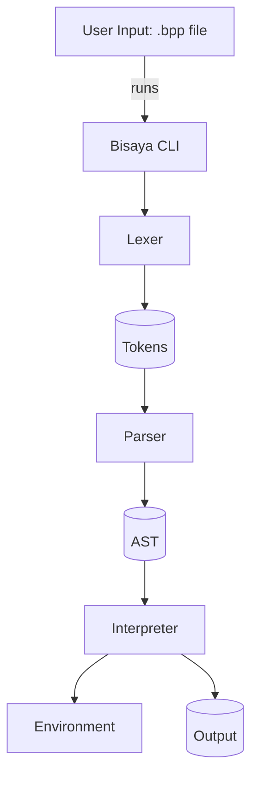
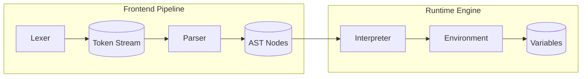
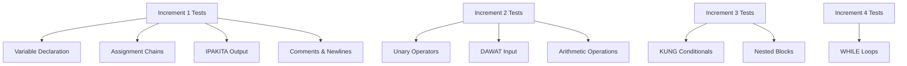

# Bisaya++ Interpreter Documentation

**Developer-friendly reference for the Bisaya++ Cebuano-based programming language interpreter**

## Table of Contents
- [Architecture Overview](#architecture-overview)  
- [Component Documentation](#component-documentation)
- [Testing Framework](#testing-framework)
- [Quick Start Guide](#quick-start-guide)
- [Validation & Debugging](#validation--debugging)

## Architecture Overview

The Bisaya++ interpreter follows a traditional three-phase architecture:



**Technology Stack:**
- **Language**: Java 21  
- **Build Tool**: Gradle
- **Testing**: JUnit 5 Jupiter
- **Architecture**: Interpreter pattern with recursive descent parser

**System Flow**: CLI → Lexer → Parser → Interpreter → Output

## Component Documentation

### Core Specifications
| Component | Specification | Functions Reference |
|-----------|---------------|---------------------|
| **Lexer** | [`lexer-specification.md`](./lexer-specification.md) | [`lexer-functions.md`](./lexer-functions.md) |
| **Parser** | [`parser-specification.md`](./parser-specification.md) | [`parser-functions.md`](./parser-functions.md) |
| **Interpreter** | [`interpreter-specification.md`](./interpreter-specification.md) | [`interpreter-functions.md`](./interpreter-functions.md) |

### Testing Documentation
| Guide | Purpose |
|-------|---------|
| **[Testing Guide](./testing-guide.md)** | Comprehensive JUnit testing framework, debugging workflows, and test writing guidelines |
| **[Testing Functions](./testing-functions.md)** | Function-level tracing and call-graph reference for JUnit test implementation |

### Increment 1 Test Coverage (NEW)
| Document | Description |
|----------|-------------|
| **[Quick Reference](./increment1-test-quickref.md)** | Quick overview of test results and coverage (62 tests, 90% pass rate) |
| **[Test Summary](./increment1-test-summary.md)** | Detailed summary of all test additions and organization |
| **[Coverage Analysis](./increment1-test-coverage-analysis.md)** | Comprehensive analysis with recommendations and feature matrix |

### Component Interaction



**Usage Patterns:**
- **Specifications** (`*-specification.md`): Architecture, algorithms, error handling, Bisaya++ language specifics
- **Functions** (`*-functions.md`): Call graphs, debug recipes, input→output mappings, common pitfalls

### Bisaya++ Language Specifics
- **Reserved Words**: Uppercase keywords (`SUGOD`, `MUGNA`, `IPAKITA`) cannot be identifiers
- **Escape Sequences**: `[]` processed outside string literals only  
- **Special Tokens**: `$` → newline, `&` → concatenation
- **Comments**: `--` to end-of-line
- **Incremental Features**: Current implementation supports Increment 1-4 features

## Testing Framework

### JUnit 5 Test Suite Structure

```
app/src/test/java/com/bisayapp/
├── Increment1Tests.java         // Core language features (variables, assignment, output)
├── LexerTest.java              // Token recognition and lexical analysis  
├── ParserTest.java             // AST construction and syntax validation
├── InterpreterPrintTest.java   // Output formatting and IPAKITA command
├── VarDeclAssignTest.java      // Variable declaration and assignment chains
├── ReservedWordsAndIdentifiersTest.java  // Keyword validation
└── CommentAndNewlineRulesTest.java       // Comment parsing and $ tokens
```

### Running Tests

**All Tests:**
```bash
./gradlew test
```

**Specific Test Class:**
```bash
./gradlew test --tests "com.bisayapp.Increment1Tests"
./gradlew test --tests "com.bisayapp.LexerTest" 
```

**Specific Test Method:**
```bash
./gradlew test --tests "com.bisayapp.Increment1Tests.testBasicVariableDeclaration"
```

**Test Reports:**
- **HTML Report**: `app/build/reports/tests/test/index.html`
- **XML Results**: `app/build/test-results/test/`

### Test Categories by Increment



### Test Validation Commands

**Increment 1 Validation:**
```bash
# Test core functionality
./gradlew test --tests "*Increment1*"

# Test individual components  
./gradlew test --tests "*Lexer*"
./gradlew test --tests "*Parser*"
./gradlew test --tests "*Interpreter*"
```

**Sample Program Testing:**
```bash
# Run sample programs (manual validation)
cd app
./gradlew run --args="../samples/hello.bpp"
./gradlew run --args="../samples/arithmetic.bpp"  
./gradlew run --args="../samples/simple.bpp"
```

### Debug Test Failures

**Common Debugging Workflow:**
1. **Token Issues**: Check [`lexer-functions.md`](./lexer-functions.md) → `scanTokens()` → `identifier()` 
2. **Parse Errors**: Check [`parser-functions.md`](./parser-functions.md) → `parseStatement()` → specific grammar rules
3. **Runtime Errors**: Check [`interpreter-functions.md`](./interpreter-functions.md) → `visit*()` methods
4. **Test Failures**: Check [`testing-guide.md`](./testing-guide.md) → debugging workflows and test patterns

**Example Debug Path** (for `"MUGNA"` token issues):
```
Input: "MUGNA x" → Lexer.identifier() → TokenType lookup → MUGNA keyword
```

## Quick Start Guide

### For Developers
1. **Read Architecture**: Start with this README
2. **Component Deep-dive**: Use specification files for design understanding  
3. **Function Tracing**: Use function reference files when debugging
4. **Test-Driven**: Run tests to validate changes

### For Instructors  
1. **Validate Setup**: `./gradlew test` should pass all increment tests
2. **Check Features**: Each increment test class covers specific requirements
3. **Sample Programs**: Test with `samples/*.bpp` files for demonstration
4. **Error Handling**: Tests include edge cases and error conditions

## Validation & Debugging

### Quality Gates Checklist
- [ ] All tests pass: `./gradlew test`  
- [ ] Sample programs execute correctly
- [ ] Reserved words properly rejected as identifiers
- [ ] Escape sequences `[]` handled correctly  
- [ ] Comments `--` parsed without errors
- [ ] Variable assignment chains work (`x=y=4`)

### Cross-References
- **Source Code**: [`../app/src/main/java/com/bisayapp/`](../app/src/main/java/com/bisayapp/)
- **Test Suite**: [`../app/src/test/java/com/bisayapp/`](../app/src/test/java/com/bisayapp/)  
- **Sample Programs**: [`../samples/*.bpp`](../samples/)
- **Build Config**: [`../app/build.gradle`](../app/build.gradle)

### Maintenance Notes
Keep documentation synced with increments. Update token catalogs, grammar tables, and test cases when adding new features (DAWAT, KUNG conditionals, loops). Record spec deviations in component-specific "Decision Log" sections.

---

**File**: `docs/README.md` — Central documentation hub for Bisaya++ interpreter development and testing
