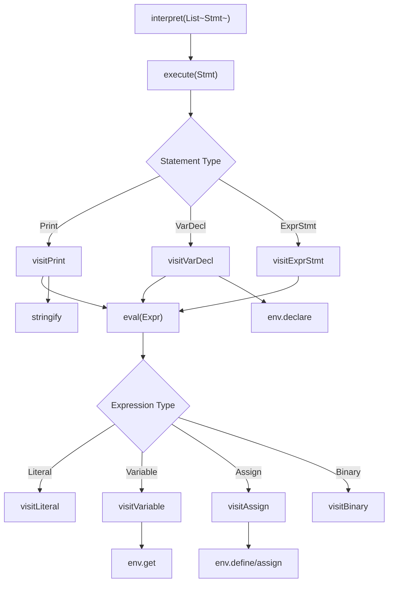

# Interpreter Functions Reference

**Function-level debugging and call-graph reference for `app/src/main/java/com/bisayapp/Interpreter.java`**

## Table of Contents
- [Call Graph Overview](#call-graph-overview)
- [Public Interface](#public-interface)
- [Statement Visitors](#statement-visitors)
- [Expression Visitors](#expression-visitors)
- [Helper Functions](#helper-functions)
- [Environment Functions](#environment-functions)
- [Debug Recipes](#debug-recipes)

## Call Graph Overview



## Public Interface

### `interpret(List<Stmt> program)`

**Purpose**: Main entry point executing a complete Bisaya++ program

**Input**: 
- `program`: List of statement AST nodes from Parser

**Output**: `void` (side effects: variable changes, console output)

**Process**:
```java
for (Stmt s : program) execute(s);
```

**Side Effects**:
- Modifies `Environment env` state  
- Writes to `PrintStream out`
- May throw `RuntimeException` on errors

**Debug Recipe**: Program not executing?
1. Check if `program.isEmpty()` 
2. Verify each `Stmt` type in debugger
3. Step through `execute(s)` for each statement

### `Interpreter(PrintStream out)` 

**Purpose**: Constructor with output stream injection

**Input**: 
- `out`: Target for IPAKITA output (System.out in production, test stream for testing)

**Usage Examples**:
```java
// Production
new Interpreter(System.out)

// Testing
ByteArrayOutputStream buffer = new ByteArrayOutputStream();
new Interpreter(new PrintStream(buffer))
```

## Statement Visitors

### `visitPrint(Stmt.Print s) → Void`

**Purpose**: Execute IPAKITA command with concatenation (newlines controlled by $ escape sequence)

**Input**: 
- `s.parts`: List of expressions to concatenate and output

**Algorithm**:
```java
StringBuilder sb = new StringBuilder();
for (Expr e : s.parts) sb.append(stringify(eval(e)));
out.print(sb.toString());
```

**Output Behavior**:
- Evaluates each expression → `stringify()` → concatenate
- No automatic newlines added - use `$` escape sequence for explicit newlines
- Sends to `PrintStream`

**Debug Recipe**: Wrong IPAKITA output?
1. Check `s.parts.size()` - are all expressions parsed?
2. Step through `eval(e)` for each part - correct values?
3. Verify `stringify()` results - proper formatting?
4. Ensure `$` is used where newlines are needed
4. Check final concatenation and newline addition

**Examples**:
```bpp
IPAKITA: x & "hello" & $
```
→ `s.parts = [Variable("x"), Literal("hello"), Literal("\n")]`
→ Evaluates to: `"5" + "hello" + "\n"` → `"5hello\n\n"`

### `visitVarDecl(Stmt.VarDecl s) → Void`

**Purpose**: Execute MUGNA variable declarations with type registration

**Input**:
- `s.type`: TokenType (NUMERO, LETRA, TINUOD, TIPIK)
- `s.items`: List of variable items with names and optional initializers

**Algorithm**:
```java
for (Stmt.VarDecl.Item it : s.items) {
    Object value = (it.init == null) ? null : eval(it.init);
    env.declare(it.name, s.type, value);
}
```

**Side Effects**:
- Calls `env.declare()` for each variable  
- Type coercion applied via `Environment.coerce()`

**Debug Recipe**: Variable declaration issues?
1. Check `s.type` - correct TokenType enum?
2. Verify `s.items` list - all variables parsed?
3. Step through `eval(it.init)` - initializer evaluated correctly?
4. Check `env.declare()` call - type coercion succeeding?

**Examples**:
```bpp  
MUGNA NUMERO x=5, y, z=10
```
→ `s.type = NUMERO`  
→ `s.items = [Item("x", Literal(5)), Item("y", null), Item("z", Literal(10))]`  
→ Calls: `declare("x", NUMERO, 5)`, `declare("y", NUMERO, null)`, `declare("z", NUMERO, 10)`

### `visitExprStmt(Stmt.ExprStmt s) → Void`

**Purpose**: Execute standalone expressions (assignments, function calls)

**Input**: 
- `s.expr`: Expression to evaluate for side effects

**Algorithm**: 
```java
eval(s.expr);  // Evaluate but discard return value
```

**Common Use**: Assignment statements like `x = 5`

**Debug Recipe**: Assignment not working?
1. Check `s.expr` type - is it `Expr.Assign`?
2. Step into `eval(s.expr)` 
3. Verify `visitAssign()` is called correctly

## Expression Visitors  

### `visitLiteral(Expr.Literal e) → Object`

**Purpose**: Return literal values directly (numbers, strings, characters)

**Input**: 
- `e.value`: Raw literal value from Parser

**Output**: `e.value` as-is (no processing)

**Examples**:
```bpp
42      → Integer(42)
"hello" → String("hello")  
'c'     → Character('c')
```

### `visitVariable(Expr.Variable e) → Object`

**Purpose**: Look up variable values with special TINUOD formatting

**Input**:
- `e.name`: Variable name to lookup

**Algorithm**:
```java
Object v = env.get(e.name);           // May throw if undefined
TokenType t = env.getType(e.name);
if (t == TokenType.TINUOD && v instanceof Boolean b) {
    return b ? "OO" : "DILI";         // Bisaya++ boolean display
}
return v;
```

**Special Behavior**: TINUOD variables display as `"OO"`/`"DILI"` instead of `true`/`false`

**Debug Recipe**: Variable lookup failing?
1. Check `env.get(e.name)` - variable defined?
2. Verify `env.getType(e.name)` - correct type stored?  
3. For TINUOD: is boolean conversion working?

**Examples**:
```bpp
MUGNA NUMERO x=5      → visitVariable("x") → Integer(5)
MUGNA TINUOD flag="OO" → visitVariable("flag") → "OO"  
```

### `visitAssign(Expr.Assign e) → Object`

**Purpose**: Assign values to variables with implicit declaration fallback

**Input**:
- `e.name`: Variable name to assign  
- `e.value`: Expression to evaluate and assign

**Algorithm**:
```java
Object v = eval(e.value);
if (!env.isDefined(e.name)) env.define(e.name, v);     // Implicit declaration
else env.assign(e.name, v);                            // Type-checked assignment  
return v;
```

**Return**: Assigned value (enables chaining like `x = y = 4`)

**Debug Recipe**: Assignment problems?
1. Check `eval(e.value)` - right-hand side evaluating correctly?
2. Verify `env.isDefined(e.name)` - expected declaration state?
3. If declared: check `env.assign()` - type coercion working?
4. If undeclared: check `env.define()` - implicit declaration succeeding?

**Examples**:
```bpp
x = 5       → env.define("x", 5) if x undeclared
x = 10      → env.assign("x", 10) if x already declared with type
```

### `visitBinary(Expr.Binary e) → Object`

**Purpose**: Evaluate binary operations (currently only concatenation)

**Input**:
- `e.left`, `e.right`: Left and right operand expressions
- `e.operator`: Binary operator token

**Algorithm**:
```java
Object left = eval(e.left);
Object right = eval(e.right);

if (e.operator.type == TokenType.AMPERSAND) {
    return stringify(left) + stringify(right);
}

throw new RuntimeException("Unsupported binary operator: " + e.operator.lexeme);
```

**Current Support**: Only `&` (AMPERSAND) concatenation

**Debug Recipe**: Binary operation errors?
1. Check `e.operator.type` - expected TokenType?
2. Verify `eval(e.left)` and `eval(e.right)` - operands correct?
3. For concatenation: check `stringify()` results
4. For unsupported ops: implement new operator handling

**Examples**:
```bpp
"hello" & "world"  → stringify("hello") + stringify("world") → "helloworld"
x & 42             → stringify(5) + stringify(42) → "542"
```

## Helper Functions

### `execute(Stmt s) → void`

**Purpose**: Internal dispatcher calling appropriate statement visitor

**Algorithm**: `s.accept(this)` - uses Visitor pattern dispatch

**Debug Recipe**: Statement not executing?
1. Verify `s` is not null
2. Check `s.getClass()` - expected statement type?
3. Ensure corresponding `visit*()` method exists

### `eval(Expr e) → Object` 

**Purpose**: Internal dispatcher calling appropriate expression visitor

**Algorithm**: `e.accept(this)` - uses Visitor pattern dispatch

**Debug Recipe**: Expression evaluation failing?
1. Verify `e` is not null  
2. Check `e.getClass()` - expected expression type?
3. Ensure corresponding `visit*()` method exists

### `stringify(Object v) → String`

**Purpose**: Convert runtime values to display strings with special formatting

**Algorithm**:
```java
if (v == null) return "null";
if (v instanceof Double d) {
    if (d == d.intValue()) return String.valueOf(d.intValue());  // 42.0 → "42"
    return v.toString();                                         // 3.14 → "3.14" 
}
return v.toString();
```

**Special Cases**:
- `null` → `"null"`
- Integer-valued doubles → no decimal point
- Other objects → `toString()`

**Debug Recipe**: Wrong string output?
1. Check input value type and content
2. For doubles: verify integer detection logic
3. Compare with expected output format

## Environment Functions

### `env.declare(String name, TokenType type, Object value)`

**Purpose**: Register new variable with type and coerced initial value

**Location**: `Environment.java`  
**Side Effects**: Updates both `types` and `values` maps
**Type Coercion**: Automatically applied via `coerce(type, value)`

### `env.assign(String name, Object value)`  

**Purpose**: Update existing variable with type-checked value

**Precondition**: Variable must exist (`RuntimeException` if not)
**Type Coercion**: Applied if variable has declared type

### `env.get(String name) → Object`

**Purpose**: Retrieve current variable value  

**Precondition**: Variable must exist (`RuntimeException` if not)
**Return**: Raw stored value (before any display formatting)

### `env.getType(String name) → TokenType`

**Purpose**: Retrieve declared type of variable (or null if untyped)

## Debug Recipes

### Common Issue Patterns

**"Undefined variable 'x'"**
1. Check: Was `MUGNA` statement executed for `x`?  
2. Check: Was assignment `x = ...` executed for implicit declaration?
3. Debug: Step through `visitVarDecl()` or `visitAssign()`

**Wrong IPAKITA output**  
1. Check: Are all expressions in `s.parts` correct?
2. Check: Do `eval()` results match expected values?
3. Check: Is `stringify()` formatting correctly?
4. Check: Newline behavior - expected trailing `\n`?

**Type coercion errors**
1. Check: `Environment.coerce()` logic for target type
2. Check: Input value format and type  
3. Debug: Step through coercion switch statement

**Assignment to wrong type**
1. Check: `env.getType(name)` - what type was declared?
2. Check: `coerce(declaredType, newValue)` - valid conversion?
3. Verify: Assignment vs declaration logic in `visitAssign()`

### Tracing Execution Paths

**Variable Declaration Path**:
```
MUGNA NUMERO x=5 → Parser → Stmt.VarDecl → visitVarDecl() → env.declare("x", NUMERO, 5) → coerce(NUMERO, 5) → Integer(5)
```

**Variable Access Path**:
```  
IPAKITA: x → Parser → Stmt.Print → visitPrint() → eval(Variable("x")) → visitVariable() → env.get("x") → Integer(5) → stringify() → "5"
```

**Assignment Path**:
```
x = 10 → Parser → Stmt.ExprStmt → visitExprStmt() → eval(Assign("x", 10)) → visitAssign() → env.assign("x", 10) → coerce(NUMERO, 10) → Integer(10)
```

---

**Links:**
- Interpreter spec: [`interpreter-specification.md`](./interpreter-specification.md)
- Environment source: [`../app/src/main/java/com/bisayapp/Environment.java`](../app/src/main/java/com/bisayapp/Environment.java)
- Interpreter source: [`../app/src/main/java/com/bisayapp/Interpreter.java`](../app/src/main/java/com/bisayapp/Interpreter.java)
- Test cases: [`../app/src/test/java/com/bisayapp/InterpreterPrintTest.java`](../app/src/test/java/com/bisayapp/InterpreterPrintTest.java)