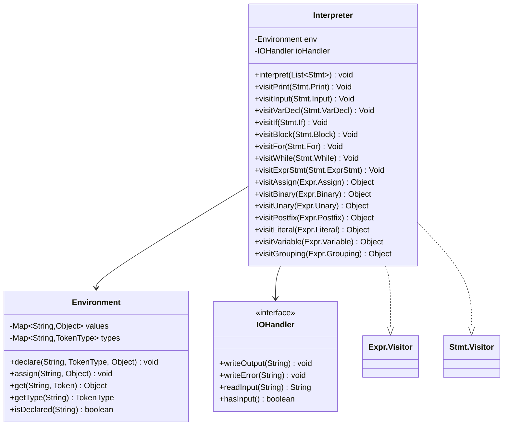
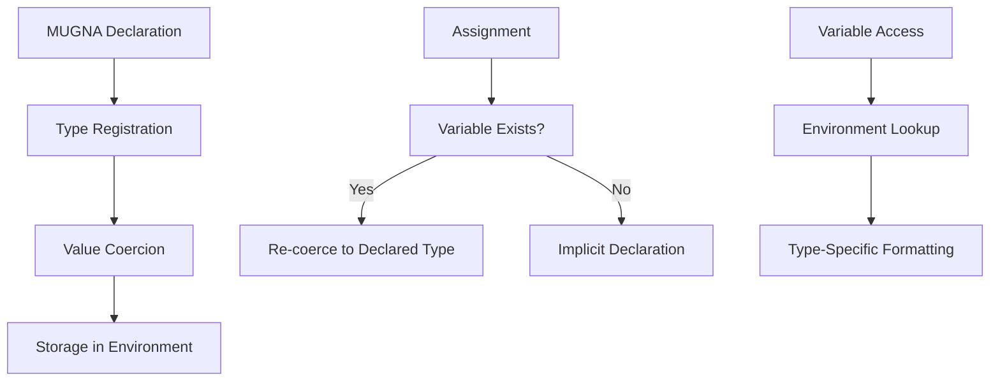
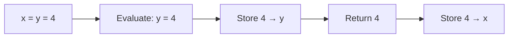
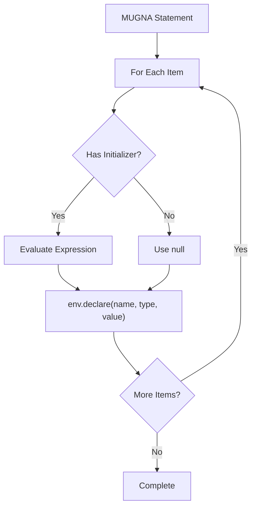
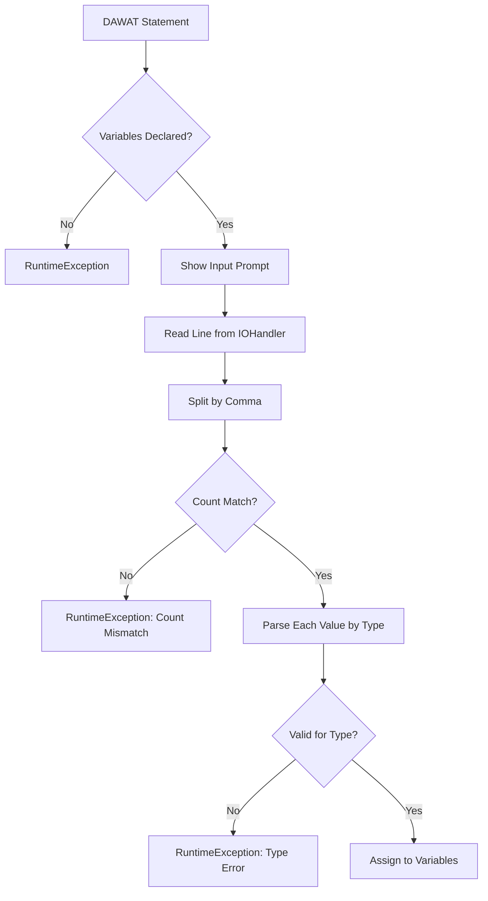
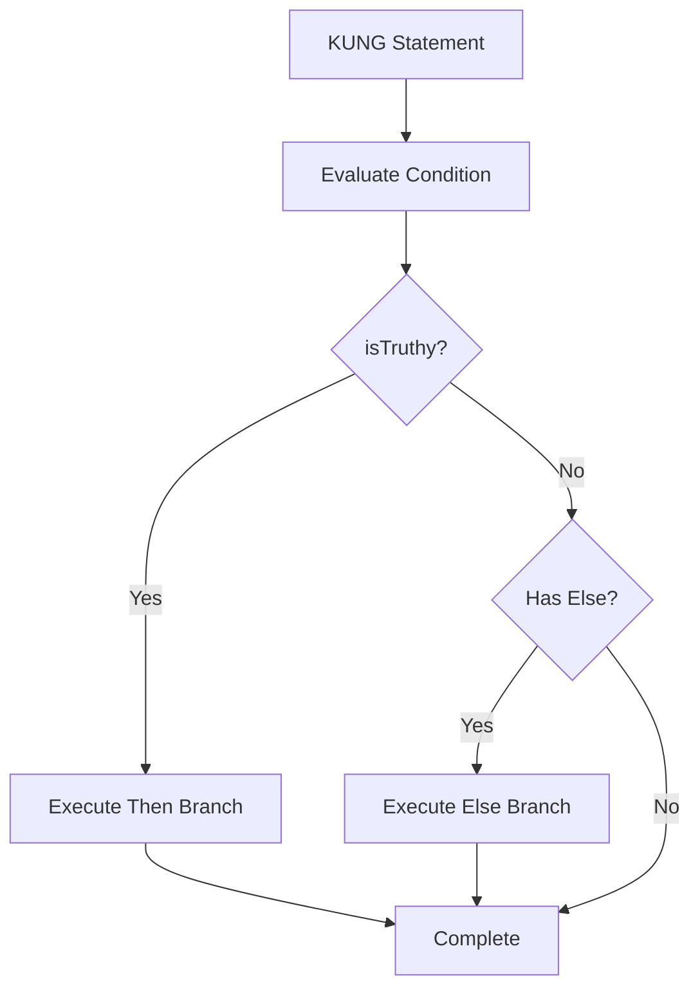
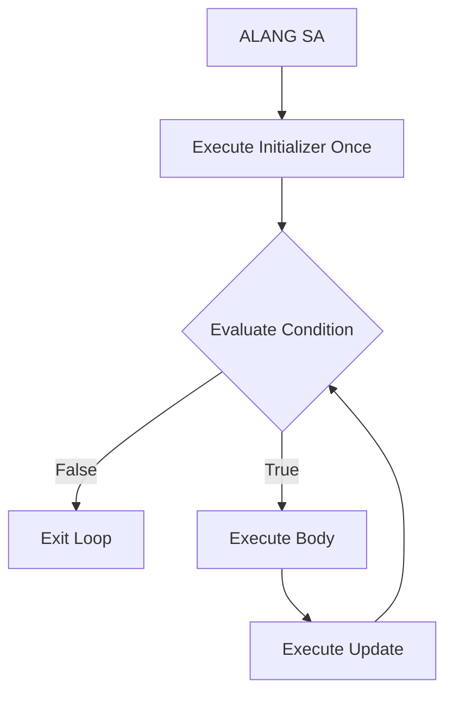
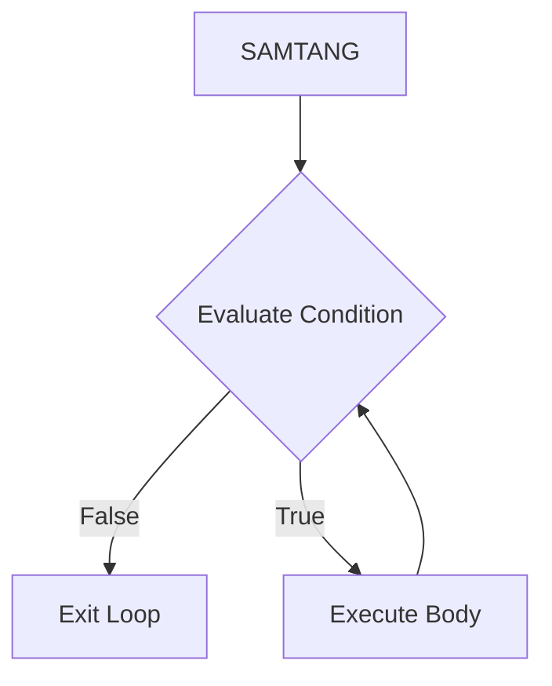

# Interpreter Specification

**Runtime execution semantics and environment model for Bisaya++ programs**

## Table of Contents
- [Architecture Overview](#architecture-overview)
- [Runtime Environment](#runtime-environment) 
- [Value Model & Type System](#value-model--type-system)
- [Expression Evaluation](#expression-evaluation)
- [Statement Execution](#statement-execution)
- [Error Handling](#error-handling)
- [I/O Behavior](#io-behavior)
- [Integration Points](#integration-points)

## Architecture Overview

The Bisaya++ interpreter implements the **Visitor pattern** for AST traversal with a single-scope environment model:



**Core Components:**
- **Interpreter**: AST visitor executing statements and evaluating expressions
- **Environment**: Variable storage with type tracking and coercion
- **IOHandler**: I/O abstraction for IPAKITA/DAWAT commands (supports both console and GUI)

## Runtime Environment

### Variable Lifecycle



### Environment Operations

| Operation | Input | Output | Side Effects |
|-----------|-------|---------|--------------|
| `declare(name, type, value)` | Variable name, TokenType, initial value | void | Stores type mapping + coerced value, throws if already declared |
| `assign(name, value)` | Variable name, new value | void | Updates value with type coercion, throws if undefined |
| `get(name, token)` | Variable name, token (for errors) | Current value | RuntimeException if undefined |
| `getType(name)` | Variable name | TokenType or null | Returns declared type |
| `isDeclared(name)` | Variable name | boolean | Checks if variable exists |

**Scope Model**: Single global scope (no nested environments in current implementation)

## Value Model & Type System

### Bisaya++ Data Types

| Type | TokenType | Java Representation | Coercion Rules |
|------|-----------|---------------------|----------------|
| **NUMERO** | `NUMERO` | `Integer` | Numbers → `intValue()`, String digits → `Integer.valueOf()` |
| **TIPIK** | `TIPIK` | `Double` | Numbers → `doubleValue()`, String decimals → `Double.valueOf()` |
| **LETRA** | `LETRA` | `Character` | Character as-is, String → `charAt(0)` |
| **TINUOD** | `TINUOD` | `Boolean` | `"OO"` → `true`, `"DILI"` → `false` |

### Type Coercion Examples

```java
// NUMERO coercion
coerce(NUMERO, 42.7)     → 42
coerce(NUMERO, "123")    → 123
coerce(NUMERO, "abc")    → RuntimeException

// TINUOD coercion  
coerce(TINUOD, "OO")     → true
coerce(TINUOD, "DILI")   → false
coerce(TINUOD, true)     → true
```

### Value Display Formatting

**TINUOD Variables**: Boolean values display as Bisaya++ literals
```java
// visitVariable() for TINUOD type
Boolean.TRUE  → "OO"    
Boolean.FALSE → "DILI"
```

**Numeric Display**: Integers show without decimal point
```java
// stringify() method
42.0 → "42"    // not "42.0"
3.14 → "3.14"  // keeps decimals when needed
```

## Expression Evaluation

### Binary Operations (Current Implementation)

| Operator | TokenType | Operand Types | Result Type | Example |
|----------|-----------|---------------|-------------|---------|
| **&** | `AMPERSAND` | Any → String | String | `"hello" & "world"` → `"helloworld"` |
| **+** | `PLUS` | Number, Number | Number | `5 + 3` → `8` |
| **-** | `MINUS` | Number, Number | Number | `10 - 4` → `6` |
| **\*** | `STAR` | Number, Number | Number | `6 * 7` → `42` |
| **/** | `SLASH` | Number, Number | Number | `15 / 3` → `5` |
| **%** | `PERCENT` | Number, Number | Number | `10 % 3` → `1` |
| **>** | `GREATER` | Number, Number | Boolean | `5 > 3` → `true` |
| **>=** | `GREATER_EQUAL` | Number, Number | Boolean | `5 >= 5` → `true` |
| **<** | `LESS` | Number, Number | Boolean | `3 < 5` → `true` |
| **<=** | `LESS_EQUAL` | Number, Number | Boolean | `3 <= 3` → `true` |
| **==** | `EQUAL_EQUAL` | Any, Any | Boolean | `5 == 5` → `true` |
| **<>** | `LT_GT` | Any, Any | Boolean | `5 <> 3` → `true` |
| **UG** | `UG` | Boolean, Boolean | Boolean | `"OO" UG "OO"` → `true` (AND) |
| **O** | `O` | Boolean, Boolean | Boolean | `"OO" O "DILI"` → `true` (OR) |

**Arithmetic Operations**: Support both NUMERO (Integer) and TIPIK (Float)
- Integer + Integer → Integer
- Any Float operation → Float

**Comparison Operations**: Return Boolean values stored as `"OO"` or `"DILI"`

**Logical Operations**: 
- **Short-circuit evaluation**: `UG` stops at first false, `O` stops at first true
- Operands must be Boolean type (enforced at runtime)

### Unary and Postfix Operations

| Operator | TokenType | Position | Effect | Example |
|----------|-----------|----------|---------|---------|
| **-** | `MINUS` | Prefix | Negation | `-x` → negative value |
| **+** | `PLUS` | Prefix | Positive (no-op) | `+x` → same value |
| **++** | `PLUS_PLUS` | Prefix | Pre-increment | `++x` → increment then return |
| **++** | `PLUS_PLUS` | Postfix | Post-increment | `x++` → return then increment |
| **--** | `MINUS_MINUS` | Prefix | Pre-decrement | `--x` → decrement then return |
| **--** | `MINUS_MINUS` | Postfix | Post-decrement | `x--` → return then decrement |
| **DILI** | `DILI` | Prefix | Logical NOT | `DILI (x > 5)` → boolean negation |

**Increment/Decrement Behavior**:
- Requires variable as operand (not literals)
- Updates variable value in environment
- Prefix: modifies first, returns new value
- Postfix: returns old value, then modifies

### Assignment Expressions

**Chained Assignment** (`x = y = 4`):


**Assignment Semantics:**
- **Declared Variable**: Must exist, throws error if undefined
- **Type Coercion**: Value coerced to declared type
- **Return Value**: Returns assigned value (enables chaining)

## Statement Execution

### Variable Declaration (MUGNA)

**Syntax**: `MUGNA <type> <name>[=<init>][, <name>[=<init>]]*`

**Execution Process:**


**Example Execution:**
```bpp
MUGNA NUMERO x=5, y, z=x*2
```
1. Evaluate `5` → `5`
2. `env.declare("x", NUMERO, 5)` → stores `Integer(5)`
3. `env.declare("y", NUMERO, null)` → stores `null`
4. Evaluate `x*2` → `10`
5. `env.declare("z", NUMERO, 10)` → stores `Integer(10)`

### Input Statement (DAWAT)

**Syntax**: `DAWAT: <var1>, <var2>, ...`

**Execution Process:**


**Type Parsing Rules:**
- **NUMERO**: Parse as integer, reject decimals
- **TIPIK**: Parse as float
- **LETRA**: Must be exactly 1 character
- **TINUOD**: Must be `"OO"` or `"DILI"`

**Example:**
```bpp
MUGNA NUMERO x, y
DAWAT: x, y
```
Input: `5, 10` → x=5, y=10

### Output Statement (IPAKITA)

**Concatenation Process:**


**Newline Behavior:**
- No automatic newlines - users have explicit control via `$` token
- Special `$` token from lexer produces `\n` character for explicit newlines

### Conditional Statements (KUNG)

**Forms:**
1. **Simple If**: `KUNG (condition) PUNDOK{ statements }`
2. **If-Else**: `KUNG (condition) PUNDOK{ ... } KUNG WALA PUNDOK{ ... }`
3. **If-ElseIf-Else**: `KUNG (condition) PUNDOK{ ... } KUNG DILI (condition) PUNDOK{ ... } KUNG WALA PUNDOK{ ... }`

**Execution:**


**Truthiness Rules:**
- Boolean `true` or String `"OO"` → truthy
- Boolean `false` or String `"DILI"` → falsy
- Numbers, characters, null → RuntimeException

### Loop Statements

#### For Loop (ALANG SA)

**Syntax**: `ALANG SA (init, condition, update) PUNDOK{ body }`

**Execution:**


**Example:**
```bpp
ALANG SA (ctr=1, ctr<=10, ctr++)
PUNDOK{
    IPAKITA: ctr & $ 
}
```

#### While Loop (SAMTANG)

**Syntax**: `SAMTANG (condition) PUNDOK{ body }`

**Execution:**


**Example:**
```bpp
MUGNA NUMERO ctr=1
SAMTANG (ctr <= 5)
PUNDOK{
    IPAKITA: ctr & $
    ctr = ctr + 1
}
```

### Block Statement (PUNDOK)

**Purpose**: Group multiple statements together

**Execution**: Sequential execution of all statements in the block

### Expression Statements

Simple wrapper executing expressions for side effects (assignments, increment/decrement).

## Error Handling

### Runtime Exception Categories

| Error Type | Trigger | Message Pattern | Recovery |
|------------|---------|-----------------|----------|
| **Undefined Variable** | `env.get()` on missing var | `"[line X col Y] Undefined variable 'name'"` | None - program terminates |
| **Undeclared Variable (DAWAT)** | Input to undeclared var | `"Undefined variable 'name'. Variables must be declared with MUGNA before using in DAWAT"` | None - program terminates |
| **Already Declared** | `env.declare()` on existing var | `"Variable 'name' is already declared"` | None - program terminates |
| **Type Coercion** | Invalid type conversion | `"Type error: cannot assign X to Y"` | None - program terminates |
| **Type Mismatch (Operators)** | Wrong operand types | `"type error: operand must be a number for operator '+'"` | None - program terminates |
| **Division by Zero** | Divide/modulo by zero | `"Division by zero"` or `"Modulo by zero"` | None - program terminates |
| **Invalid Boolean** | Non-boolean in condition | `"Condition cannot be null"` / `"String 'X' cannot be used as boolean condition"` | None - program terminates |
| **DAWAT Input Errors** | Input validation failures | `"DAWAT expects N value(s), but got M"` | None - program terminates |
| **No Input Available** | Empty input stream | `"DAWAT: No input available (empty input stream)"` | None - program terminates |
| **Invalid Increment Target** | `++` or `--` on non-variable | `"Increment operator requires a variable"` | None - program terminates |

**Error Examples:**
```bpp
@@ Undefined variable access
IPAKITA: unknown_var
→ RuntimeException: "[line 2 col 10] Undefined variable 'unknown_var'. Variables must be declared with MUGNA before use."

@@ Type coercion failure  
MUGNA NUMERO x="abc"
→ RuntimeException: "Type error: cannot assign abc to NUMERO"

@@ DAWAT with undeclared variable
DAWAT: undeclared_x
→ RuntimeException: "Undefined variable 'undeclared_x'. Variables must be declared with MUGNA before using in DAWAT."

@@ Division by zero
MUGNA NUMERO x=10, y=0
IPAKITA: x / y
→ RuntimeException: "Division by zero."

@@ Non-boolean in condition
MUGNA NUMERO x=5
KUNG (x) PUNDOK{ IPAKITA: "test" }
→ RuntimeException: "NUMERO/TIPIK value cannot be used as boolean condition. Use comparison operators (>, <, ==, etc.)"
```

## I/O Behavior

### Output Formatting

**String Representation Rules:**
1. `null` → `"null"`
2. Integer-valued numbers → no decimal point (`42.0` → `"42"`, `42` → `"42"`)
3. Float values → show decimals (`3.14` → `"3.14"`)
4. Boolean → `"OO"` or `"DILI"`
5. Other objects → `toString()`

**TINUOD Display**: Variables of TINUOD type show Bisaya++ boolean literals
```bpp
MUGNA TINUOD flag="OO"  
IPAKITA: flag           @@ outputs: "OO"
```

**Escape Sequence Handling**: `[&]` from lexer becomes literal `&` in output

### Input Handling (DAWAT)

**Input Process:**
1. Prompt user via `IOHandler.readInput()`
2. Split input by commas
3. Validate count matches variable count
4. Parse each value according to variable's declared type
5. Assign parsed values to variables

**Type-Specific Parsing:**
- **NUMERO**: Integer only, reject decimals
- **TIPIK**: Float/double values
- **LETRA**: Exactly one character
- **TINUOD**: Must be `"OO"` or `"DILI"`

### IOHandler Integration

The interpreter uses an `IOHandler` interface for I/O operations, supporting both console and GUI environments:

```java
// Console usage (production)
IOHandler handler = new ConsoleIOHandler(System.out, System.err, System.in);
new Interpreter(handler)

// GUI usage (IDE)
IOHandler handler = new GUIIOHandler(outputPanel, inputDialog);
new Interpreter(handler)
```

**IOHandler Methods:**
- `writeOutput(String)` - Output for IPAKITA
- `writeError(String)` - Error messages
- `readInput(String prompt)` - Input for DAWAT
- `hasInput()` - Check if input available

## Integration Points

### Parser → Interpreter

**Input**: `List<Stmt>` AST from Parser  
**Process**: Sequential execution via `interpret(List<Stmt>)`

### Lexer → Interpreter (Indirect)

**Special Tokens Processed:**
- `$` (DOLLAR) → Newline character in string literals
- `&` (AMPERSAND) → Concatenation operator
- `[...]` escape sequences → Literal characters

### Error Reporter Integration

**Current State**: Direct RuntimeException throwing  
**Future Enhancement**: Integrate with ErrorReporter for better error messages

## Performance Considerations

**Single-Pass Execution**: No optimization, direct AST interpretation  
**Memory Model**: HashMap-based variable storage  
**Type System**: Runtime type checking with coercion overhead

## Limitations (Current Implementation)

1. **Scope**: Single global environment only (no nested scopes or functions)
2. **Type System**: Runtime type checking only (no static analysis)
3. **Arrays**: Not supported
4. **Functions**: No user-defined functions
5. **Error Recovery**: No error recovery - first error terminates program
6. **Break/Continue**: Loop control statements not implemented

## Integration Examples

### Complete Program Execution

```bpp
SUGOD
MUGNA NUMERO x=5, y
MUGNA LETRA c='a'
DAWAT: y
x = x + y
KUNG (x > 5)
PUNDOK{
    IPAKITA: "x is greater than 5: " & x & $
}
IPAKITA: x & c & $
KATAPUSAN
```

**Execution Trace:**
1. `visitVarDecl()` → `env.declare("x", NUMERO, 5)`, `env.declare("y", NUMERO, null)`
2. `visitVarDecl()` → `env.declare("c", LETRA, 'a')`
3. `visitInput()` → Read input "10" → `env.assign("y", 10)`
4. `visitAssign()` → Evaluate `x + y` → `15` → `env.assign("x", 15)`
5. `visitIf()` → Evaluate `x > 5` → `true` → Execute then branch
6. `visitPrint()` → Output `"x is greater than 5: 15\n"`
7. `visitPrint()` → Output `"15a\n"`

---

**Links:**
- Parser spec: [`parser-specification.md`](./parser-specification.md)
- Lexer spec: [`lexer-specification.md`](./lexer-specification.md)  
- Function reference: [`interpreter-functions.md`](./interpreter-functions.md)
- Source: [`../app/src/main/java/com/bisayapp/Interpreter.java`](../app/src/main/java/com/bisayapp/Interpreter.java)
