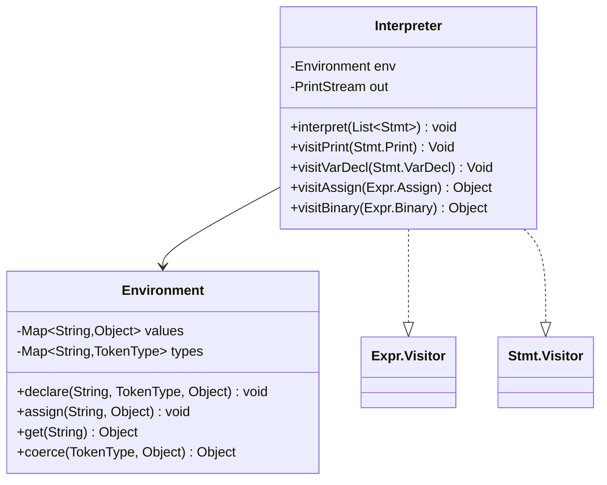
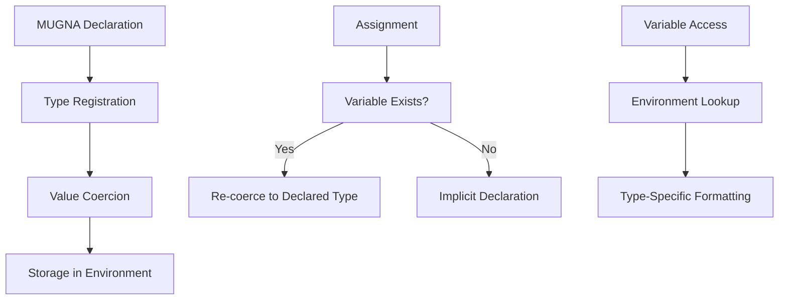
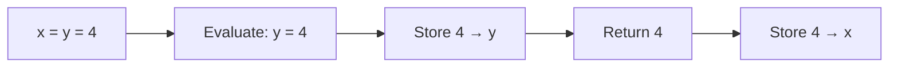
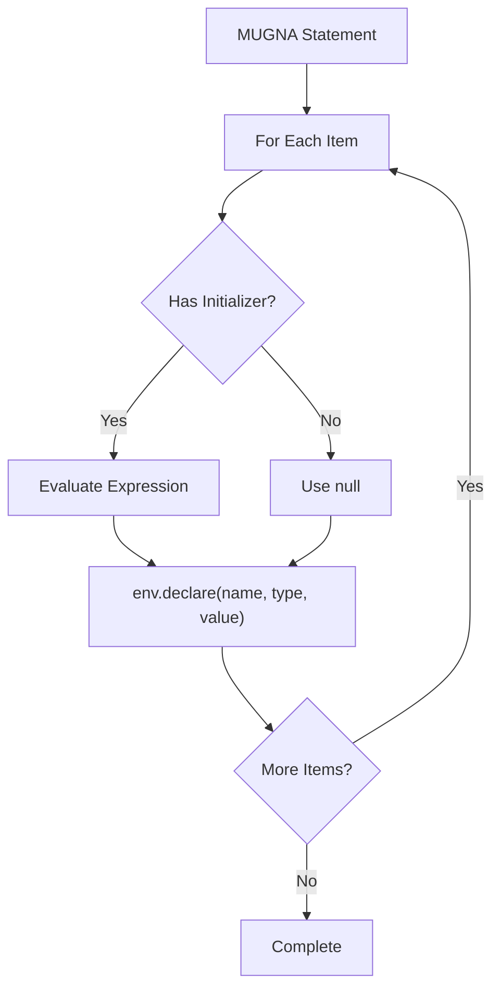

# Interpreter Specification

**Runtime execution semantics and environment model for Bisaya++ programs**

## Table of Contents
- [Architecture Overview](#architecture-overview)
- [Runtime Environment](#runtime-environment) 
- [Value Model & Type System](#value-model--type-system)
- [Expression Evaluation](#expression-evaluation)
- [Statement Execution](#statement-execution)
- [Error Handling](#error-handling)
- [I/O Behavior](#io-behavior)
- [Integration Points](#integration-points)

## Architecture Overview

The Bisaya++ interpreter implements the **Visitor pattern** for AST traversal with a single-scope environment model:



**Core Components:**
- **Interpreter**: AST visitor executing statements and evaluating expressions
- **Environment**: Variable storage with type tracking and coercion
- **PrintStream**: Output abstraction for IPAKITA commands

## Runtime Environment

### Variable Lifecycle



### Environment Operations

| Operation | Input | Output | Side Effects |
|-----------|-------|---------|--------------|
| `declare(name, type, value)` | Variable name, TokenType, initial value | void | Stores type mapping + coerced value |
| `assign(name, value)` | Variable name, new value | void | Updates value with type coercion |
| `get(name)` | Variable name | Current value | RuntimeException if undefined |
| `coerce(type, value)` | Target type, raw value | Coerced value | Type conversion or RuntimeException |

**Scope Model**: Single global scope (no nested environments in current implementation)

## Value Model & Type System

### Bisaya++ Data Types

| Type | TokenType | Java Representation | Coercion Rules |
|------|-----------|---------------------|----------------|
| **NUMERO** | `NUMERO` | `Integer` | Numbers → `intValue()`, String digits → `Integer.valueOf()` |
| **TIPIK** | `TIPIK` | `Double` | Numbers → `doubleValue()`, String decimals → `Double.valueOf()` |
| **LETRA** | `LETRA` | `Character` | Character as-is, String → `charAt(0)` |
| **TINUOD** | `TINUOD` | `Boolean` | `"OO"` → `true`, `"DILI"` → `false` |

### Type Coercion Examples

```java
// NUMERO coercion
coerce(NUMERO, 42.7)     → 42
coerce(NUMERO, "123")    → 123
coerce(NUMERO, "abc")    → RuntimeException

// TINUOD coercion  
coerce(TINUOD, "OO")     → true
coerce(TINUOD, "DILI")   → false
coerce(TINUOD, true)     → true
```

### Value Display Formatting

**TINUOD Variables**: Boolean values display as Bisaya++ literals
```java
// visitVariable() for TINUOD type
Boolean.TRUE  → "OO"    
Boolean.FALSE → "DILI"
```

**Numeric Display**: Integers show without decimal point
```java
// stringify() method
42.0 → "42"    // not "42.0"
3.14 → "3.14"  // keeps decimals when needed
```

## Expression Evaluation

### Binary Operations (Current Implementation)

| Operator | TokenType | Evaluation Rule | Example |
|----------|-----------|----------------|---------|
| **&** | `AMPERSAND` | String concatenation | `"hello" & "world"` → `"helloworld"` |

**Concatenation Algorithm:**
1. Evaluate left operand → `stringify()`
2. Evaluate right operand → `stringify()`  
3. Return `left + right`

### Assignment Expressions

**Chained Assignment** (`x = y = 4`):


**Assignment Semantics:**
- **Declared Variable**: Use type coercion to declared type
- **Undeclared Variable**: Implicit declaration without type constraint

## Statement Execution

### Variable Declaration (MUGNA)

**Syntax**: `MUGNA <type> <name>[=<init>][, <name>[=<init>]]*`

**Execution Process:**


**Example Execution:**
```bpp
MUGNA NUMERO x=5, y, z=x*2
```
1. Evaluate `5` → `5`
2. `env.declare("x", NUMERO, 5)` → stores `Integer(5)`
3. `env.declare("y", NUMERO, null)` → stores `null`
4. Evaluate `x*2` → **Error**: Multiplication not implemented yet

### Output Statement (IPAKITA)

**Concatenation Process:**


**Newline Behavior:**
- Automatic newline appended if output doesn't end with `\n`
- Special `$` token from lexer produces `\n` character

### Expression Statements

Simple wrapper executing expressions for side effects (assignments).

## Error Handling

### Runtime Exception Categories

| Error Type | Trigger | Message Pattern | Recovery |
|------------|---------|-----------------|----------|
| **Undefined Variable** | `env.get()` on missing var | `"Undefined variable 'name'"` | None - program terminates |
| **Type Coercion** | Invalid type conversion | `"Type error: cannot assign X to Y"` | None - program terminates |
| **Unsupported Operation** | Unimplemented binary ops | `"Unsupported binary operator: X"` | None - program terminates |

**Error Examples:**
```bpp
-- Undefined variable access
IPAKITA: unknown_var
→ RuntimeException: "Undefined variable 'unknown_var'"

-- Type coercion failure  
MUGNA NUMERO x="abc"
→ RuntimeException: "Type error: cannot assign abc to NUMERO"
```

## I/O Behavior

### Output Formatting

**String Representation Rules:**
1. `null` → `"null"`
2. `Double` integers → no decimal point (`42.0` → `"42"`)
3. Other objects → `toString()`

**TINUOD Display**: Variables of TINUOD type show Bisaya++ boolean literals
```bpp
MUGNA TINUOD flag="OO"  
IPAKITA: flag           -- outputs: "OO"
```

**Escape Sequence Handling**: `[&]` from lexer becomes literal `&` in output

### PrintStream Integration

```java
// Constructor injection for testability
new Interpreter(System.out)        // production
new Interpreter(mockPrintStream)   // testing
```

## Integration Points

### Parser → Interpreter

**Input**: `List<Stmt>` AST from Parser  
**Process**: Sequential execution via `interpret(List<Stmt>)`

### Lexer → Interpreter (Indirect)

**Special Tokens Processed:**
- `$` (DOLLAR) → Newline character in string literals
- `&` (AMPERSAND) → Concatenation operator
- `[...]` escape sequences → Literal characters

### Error Reporter Integration

**Current State**: Direct RuntimeException throwing  
**Future Enhancement**: Integrate with ErrorReporter for better error messages

## Performance Considerations

**Single-Pass Execution**: No optimization, direct AST interpretation  
**Memory Model**: HashMap-based variable storage  
**Type System**: Runtime type checking with coercion overhead

## Limitations (Current Implementation)

1. **Operators**: Only concatenation (`&`) implemented
2. **Scope**: Single global environment only  
3. **Input**: DAWAT command not implemented
4. **Control Flow**: KUNG/loops not implemented
5. **Functions**: No user-defined functions

## Integration Examples

### Complete Program Execution

```bpp
SUGOD
MUGNA NUMERO x=5
MUGNA LETRA c='a'
x=10
IPAKITA: x & c & $
KATAPUSAN
```

**Execution Trace:**
1. `visitVarDecl()` → `env.declare("x", NUMERO, 5)`
2. `visitVarDecl()` → `env.declare("c", LETRA, 'a')`  
3. `visitAssign()` → `env.assign("x", 10)` (coerced to Integer)
4. `visitPrint()` → evaluate `x & c & $` → `"10" + "a" + "\n"` → output `"10a\n\n"`

---

**Links:**
- Parser spec: [`parser-specification.md`](./parser-specification.md)
- Lexer spec: [`lexer-specification.md`](./lexer-specification.md)  
- Function reference: [`interpreter-functions.md`](./interpreter-functions.md)
- Source: [`../app/src/main/java/com/bisayapp/Interpreter.java`](../app/src/main/java/com/bisayapp/Interpreter.java)
