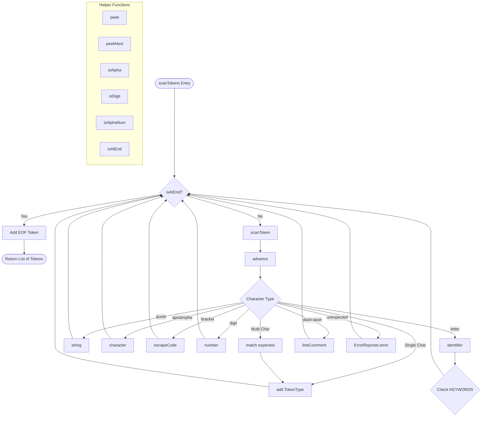

# Lexer Functions Reference & Debug Guide

Concise function-level reference for [`Lexer.java`](../app/src/main/java/com/bisayapp/Lexer.java). Use this to quickly trace logical flow and identify which functions to inspect for specific input types or bugs.

## Table of Contents
- [Call Graph](#call-graph)
- [Function Reference](#function-reference)
- [Debug Recipes](#debug-recipes)  
- [Trace Examples](#trace-examples)
- [Common Pitfalls](#common-pitfalls)

## Call Graph



**State Variables**: `start`, `current`, `line`, `col`, `tokens`, `src` (read-only)

## Function Reference

### Core Driver Functions

#### `scanTokens()` — Main Entry Point
```java
public List<Token> scanTokens()
```
**Purpose**: Main tokenization driver - scans entire source and returns token list  
**Input**: None (uses `src` field)  
**Output**: `List<Token>` with EOF token appended  
**Side Effects**: Sets `start = current`, calls `scanToken()` until `isAtEnd()`, adds EOF  
**Callers**: External (CLI/Parser/tests)  
**Debug**: Check `isAtEnd()` behavior and `current` advancement

#### `scanToken()` — Character Dispatcher
```java  
private void scanToken()
```
**Purpose**: Reads next character and dispatches to appropriate handler  
**Input**: Consumes characters via `advance()`, `match()`  
**Output**: Adds 0-1 tokens to `tokens` list  
**Side Effects**: Updates `current`, possibly `line`/`col`, calls sub-handlers  

**Key Branches for Debugging**:
- `'['` → `escapeCode()` or literal `[[]]` handling
- `'-'` → comment detection via `match('-')` → `lineComment()`  
- `"=<>!"` → multi-char operators using `match()`
- `'"'` → `string()`, `"'"` → `character()`
- `default` → `number()`, `identifier()`, or error

### Position & Character Utilities

#### `advance()` — Character Consumption
```java
private char advance()
```
**Purpose**: Return current char and increment position (consumes character)  
**Output**: Character at old `current` position  
**Side Effects**: Increments `current`  
**Debug**: Single source of position advancement - check for off-by-one errors

#### `match()` — Conditional Lookahead  
```java
private boolean match(char expected)
```
**Purpose**: If next char equals `expected`, consume and return true; else return false  
**Input**: Expected character to match  
**Output**: Boolean (true if matched and consumed)  
**Side Effects**: May increment `current` on match  
**Usage**: Multi-char operators (`==`, `<=`, `>=`, `<>`, `--`)

#### `peek()` & `peekNext()` — Safe Lookahead
```java
private char peek()           // Look at current char
private char peekNext()       // Look at current+1 char  
```
**Purpose**: Examine characters without consuming (returns `\0` if at end)  
**Side Effects**: None  
**Usage**: Loop terminators, decimal point validation (`1.5`), escape sequences

### Token Creation & Utilities

#### `add()` — Token Builder
```java
private void add(TokenType type)
```
**Purpose**: Create token from `src.substring(start, current)` and add to tokens  
**Input**: `TokenType` enum value  
**Side Effects**: Reads substring, constructs `Token` with position info  
**Debug**: Log `start`/`current` and substring if lexeme text is incorrect

#### `isAtEnd()` — End Detection
```java
private boolean isAtEnd()
```
**Purpose**: Check if scanning is complete  
**Output**: `true` if `current >= src.length()`

### Specialized Token Handlers

#### `string()` — String Literal Processor  
```java
private void string()
```
**Purpose**: Parse `"..."` literals, support multi-line strings  
**Precondition**: Opening `"` already consumed  
**Side Effects**: Advances to closing `"`, tracks line numbers, creates STRING token  
**Gotcha**: Bracket escapes `[n]` inside strings are NOT processed - collected as literal text

#### `character()` — Char Literal Processor
```java  
private void character()
```
**Purpose**: Parse `'c'` literals  
**Precondition**: Opening `'` consumed  
**Side Effects**: Validates single char + closing `'`, creates CHAR token

#### `number()` — Numeric Literal Processor
```java
private void number()
```
**Purpose**: Parse integers and decimals (`42`, `3.14`)  
**Precondition**: First digit detected  
**Output**: NUMBER token with `Double.parseDouble()` value  
**Gotcha**: All numbers stored as Double (parser handles NUMERO vs TIPIK distinction)

#### `identifier()` — Identifier/Keyword Processor  
```java
private void identifier()
```
**Purpose**: Parse identifiers, check against `KEYWORDS` map  
**Precondition**: First alpha char detected  
**Output**: Keyword token type or `IDENTIFIER`  
**Gotcha**: Case-sensitive matching - `MUGNA` is keyword, `mugna` is identifier

#### `escapeCode()` — Bracket Escape Processor
```java
private void escapeCode()  
```
**Purpose**: Handle `[code]` escape sequences outside strings  
**Precondition**: Opening `[` consumed  
**Output**: STRING token with translated value (`[n]` → `"\n"`)  
**Special Cases**: `[[]]` → `"["`, `[]]` → `"]"`, `[]` → `""`

#### `lineComment()` — Comment Processor
```java
private void lineComment()
```
**Purpose**: Consume `--` comments until newline  
**Side Effects**: Calls `advance()` until `\n` or EOF, no tokens generated

### Character Classification Helpers

```java
private boolean isDigit(char c)     // '0'-'9'  
private boolean isAlpha(char c)     // Letter or '_'
private boolean isAlphaNum(char c)  // isAlpha || isDigit
```

## Debug Recipes

### Input→Function Trace Maps

| Input Pattern | Entry Point | Function Path | Expected Output |
|---------------|-------------|---------------|----------------|
| `MUGNA` | `scanToken()` | → `identifier()` → `KEYWORDS.get()` | `[MUGNA]` |
| `variable_name` | `scanToken()` | → `identifier()` → default to `IDENTIFIER` | `[variable_name]` |
| `42` | `scanToken()` | → `number()` | `[NUMBER:42.0]` |
| `3.14` | `scanToken()` | → `number()` → decimal handling | `[NUMBER:3.14]` |
| `"Hello"` | `scanToken()` | → `string()` | `[STRING:"Hello"]` |
| `'a'` | `scanToken()` | → `character()` | `[CHAR:'a']` |
| `[n]` | `scanToken()` | → `escapeCode()` → map lookup | `[STRING:"\n"]` |
| `--comment` | `scanToken()` | → `match('-')` → `lineComment()` | (no tokens) |
| `==` | `scanToken()` | → `match('=')` → `EQUAL_EQUAL` | `[==]` |
| `<=` | `scanToken()` | → `match('=')` → `LESS_EQUAL` | `[<=]` |

### Common Debugging Steps

1. **Wrong tokens for input**: 
   - Log at `scanToken()` entry: `start`, `current`, `line`, `col`, `advance()` result
   - Instrument the specific handler (`string()`, `escapeCode()`, etc.)
   - Check `add()` calls: log `src.substring(start, current)` and `TokenType`

2. **Off-by-one lexeme errors**: 
   - Verify `start` is set before calling `advance()`
   - Check `src.substring(start, current)` bounds

3. **Wrong line/column numbers**: 
   - `line` incremented in `scanToken()` newline case AND inside `string()`
   - `col` reset to 0 on newline, then incremented at `scanToken()` end

4. **Multi-char operator issues**: 
   - Trace `match()` calls and `current` position after match
   - Print `peek()` values during lookahead

5. **Escape sequence problems**: 
   - Log the `code` string built by `escapeCode()`
   - Check `peek()`/`peekNext()` values for `[]]` special case

## Trace Examples

### 1. Keyword Recognition: `MUGNA NUMERO x = 5`
```
scanTokens() → scanToken() → advance() reads 'M' 
→ default branch → isAlpha(M) = true → identifier() 
→ consume "MUGNA" → KEYWORDS.get("MUGNA") = TokenType.MUGNA
```
**Functions to inspect**: `scanToken()`, `identifier()`, `KEYWORDS` map, `add()`

### 2. Comment Processing: `-- comment here\n`  
```
scanToken() → advance() reads '-' → match('-') = true 
→ lineComment() → advance() until peek() == '\n'
```
**Functions to inspect**: `match()`, `lineComment()` (ensure no tokens added)

### 3. String with Brackets: `"Hello[n]"`
```
scanToken() → advance() reads '"' → string() 
→ collect chars until '"' → raw content includes "[n]"
```
**Important**: Bracket escapes NOT processed inside strings - `[n]` remains literal text  
**Functions to inspect**: `string()` loop condition, character collection

### 4. Escape Sequence: `[n]`  
```
scanToken() → advance() reads '[' → escapeCode() 
→ collect "n" → advance() reads ']' → map "n" → "\n" 
→ create STRING token with lexeme "[n]" and value "\n"
```
**Functions to inspect**: `scanToken()` '[' branch, `escapeCode()`, escape mapping

### 5. Multi-char Operator: `<=`
```
scanToken() → advance() reads '<' → match('=') = true 
→ add(TokenType.LESS_EQUAL)
```
**Functions to inspect**: `match()` lookahead, position after match

## Common Pitfalls
- Column (`col`) handling is unusual: `col` is reset to 0 on newline, and incremented once at end of `scanToken()`; consider revising to maintain exact column of token start.
- Decide whether bracket escapes should be interpreted inside double-quoted `string()` contents; current behavior interprets escapes only when `[` is seen as a token.
- `number()` always produces `Double` values: if the language distinguishes integer (`NUMERO`) vs decimal (`TIPIK`), enforce in parser or change lexer to differentiate.
- `KEYWORDS` is case-sensitive; if language keywords should be case-insensitive, normalize input before lookup.

### Position Tracking Issues  
- **Column handling**: `col` reset to 0 on newline, incremented once at `scanToken()` end
- **Off-by-one**: Verify `start` set before `advance()`, check `substring(start, current)` bounds
- **Multi-line**: `line` incremented in both `scanToken()` and `string()` for embedded newlines

### Token Processing Gotchas
- **Bracket escapes**: Only processed when `[` is standalone token, NOT inside `"..."` strings  
- **Keywords**: Case-sensitive matching - `MUGNA` ≠ `mugna`
- **Numbers**: All stored as `Double` regardless of NUMERO vs TIPIK distinction  
- **Decimal parsing**: Requires digit before AND after decimal point (`1.0` ✓, `.5` ✗, `1.` ✗)

### Lookahead Traps
- **`match()` consumption**: Only advances `current` if match succeeds
- **`peek()` safety**: Returns `\0` at EOF - safe for loop conditions  
- **Special sequences**: `[[]]` → `"["`, `[]]` → `"]"` use `peekNext()` detection

### Error Recovery
- **Unterminated constructs**: Strings, chars, escapes call `ErrorReporter.error()`
- **Unknown escapes**: Generate error but insert empty string value
- **Unexpected chars**: Default case calls `ErrorReporter.error()` but continues

## Cross-References
- **Specification**: [`lexer-specification.md`](./lexer-specification.md) 
- **Implementation**: [`Lexer.java`](../app/src/main/java/com/bisayapp/Lexer.java)
- **Tests**: [`LexerTest.java`](../app/src/test/java/com/bisayapp/LexerTest.java)
- **Token Types**: [`TokenType.java`](../app/src/main/java/com/bisayapp/TokenType.java)
- **Next Phase**: [`parser-functions.md`](./parser-functions.md)

