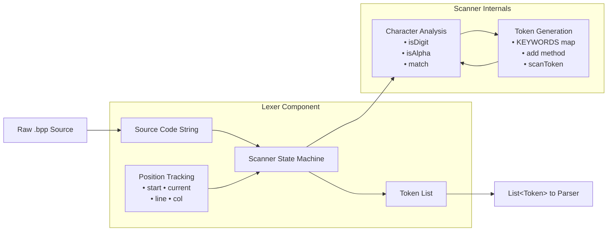
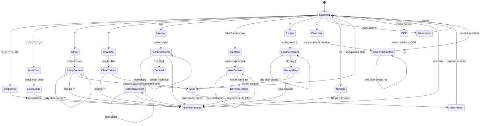

# Bisaya++ Lexer Technical Specification

## Table of Contents
- [Overview](#overview)
- [Architecture](#architecture)
- [Tokenization State Machine](#tokenization-state-machine)
- [Core Logic](#core-logic)
- [Token Types and Input Handling](#token-types-and-input-handling)
- [Bisaya++ Language Specifics](#bisaya-language-specifics)
- [Error Handling](#error-handling)
- [Performance Characteristics](#performance-characteristics)
- [Integration Points](#integration-points)
- [Testing and Validation](#testing-and-validation)

## Overview

The **Lexer** (Lexical Analyzer) is the first component of the Bisaya++ interpreter that converts raw source code into a sequence of tokens. It performs lexical analysis by breaking down input strings into meaningful units called tokens, which are consumed by the [`Parser`](./parser-specification.md).

**Key Function**: `"MUGNA NUMERO x=5"` → `[MUGNA][NUMERO][x][=][5]`

## Architecture

### Component Diagram


### Key Classes and Responsibilities

- **[`Lexer`](../app/src/main/java/com/bisayapp/Lexer.java)**: Main lexical analyzer class - state machine driver
- **[`Token`](../app/src/main/java/com/bisayapp/Token.java)**: Individual tokens with type, lexeme, value, and position
- **[`TokenType`](../app/src/main/java/com/bisayapp/TokenType.java)**: Enumeration of all possible token types
- **[`ErrorReporter`](../app/src/main/java/com/bisayapp/ErrorReporter.java)**: Handles lexical errors with line/column information

## Tokenization State Machine

The lexer operates as a finite state machine that processes characters and transitions between states based on input patterns:



## Core Logic

### Scanning Process Flow

```
START
  │
  ▼
┌─────────────┐
│ scanTokens()│
└──────┬──────┘
       │
       ▼
┌─────────────┐     NO
│ isAtEnd()?  ├─────────┐
└──────┬──────┘         │
       │YES             │
       ▼                ▼
┌─────────────┐   ┌─────────────┐
│ Add EOF     │   │ scanToken() │
│ Token       │   └──────┬──────┘
└─────────────┘          │
       │                 ▼
       ▼           ┌─────────────┐
┌─────────────┐    │ advance()   │
│ Return      │    │ Get next    │
│ tokens[]    │    │ character   │
└─────────────┘    └──────┬──────┘
                          │
                          ▼
                   ┌─────────────┐
                   │ Switch on   │
                   │ character   │
                   │ type        │
                   └──────┬──────┘
                          │
         ┌────────────────┼────────────────┐
         ▼                ▼                ▼
   ┌─────────┐    ┌─────────────┐    ┌─────────┐
   │Single   │    │Multi-char   │    │Special  │
   │Char     │    │Operators    │    │Handlers │
   │Tokens   │    │(==, <=, etc)│    │(string, │
   └─────────┘    └─────────────┘    │number)  │
                                     └─────────┘
```

### State Management

The lexer maintains several state variables:
- `start`: Beginning position of current token in source
- `current`: Current scanning position
- `line`: Current line number (for error reporting)
- `col`: Current column number (for error reporting)

## Token Types and Input Handling

### 1. Keywords and Reserved Words

**Input Pattern**: Capital letters matching predefined keywords  
**Processing**: Stored in `KEYWORDS` HashMap for O(1) lookup  
**Use Cases**:

```java
// Declaration keywords
MUGNA NUMERO x = 5    → [MUGNA][NUMERO][x][=][5]
MUGNA LETRA c = 'a'   → [MUGNA][LETRA][c][=]['a']

// Control flow keywords
KUNG (x > 0)          → [KUNG][(][x][>][0][)]
PUNDOK{ ... }         → [PUNDOK][{][...][}]

// I/O keywords
IPAKITA: x            → [IPAKITA][:][x]
DAWAT: y              → [DAWAT][:][y]

// Logical operators
x UG y O z            → [x][UG][y][O][z]
DILI (x == 0)         → [DILI][(][x][==][0][)]
```

### 2. Identifiers

**Input Pattern**: Letter or underscore followed by letters, underscores, or digits  
**Processing**: Read until non-alphanumeric character, check against keywords  
**Use Cases**:

```java
// Valid identifiers
variable_name         → [variable_name]
x                     → [x]
_counter123           → [_counter123]

// Invalid (reserved words)
NUMERO                → [NUMERO] (keyword, not identifier)
MUGNA                 → [MUGNA] (keyword, not identifier)
```

### 3. Numeric Literals

**Input Pattern**: Digits optionally followed by decimal point and more digits  
**Processing**: Parse as double, store both string and numeric value  
**Use Cases**:

```java
// Integers
42                    → [NUMBER:42]
0                     → [NUMBER:0]
123                   → [NUMBER:123]

// Decimals
3.14                  → [NUMBER:3.14]
0.5                   → [NUMBER:0.5]
100.0                 → [NUMBER:100.0]
```

### 4. String Literals

**Input Pattern**: Characters enclosed in double quotes  
**Processing**: Support multi-line strings, track line numbers  
**Use Cases**:

```java
// Simple strings
"Hello World"         → [STRING:"Hello World"]
"OO"                  → [STRING:"OO"] (boolean true)
"DILI"                → [STRING:"DILI"] (boolean false)

// Multi-line strings
"This is
a multi-line
string"               → [STRING:"This is\na multi-line\nstring"]

// Empty strings
""                    → [STRING:""]
```

### 5. Character Literals

**Input Pattern**: Single character enclosed in single quotes  
**Processing**: Extract single character value  
**Use Cases**:

```java
'a'                   → [CHAR:'a']
'Z'                   → [CHAR:'Z']
'1'                   → [CHAR:'1'] (digit character)
' '                   → [CHAR:' '] (space)
```

### 6. Escape Sequences

**Input Pattern**: `[code]` where code is escape sequence  
**Processing**: Map to actual characters, handle special cases  
**Use Cases**:

```bpp
// Special characters
[&]                   → [STRING:"&"] (literal ampersand)
[n]                   → [STRING:"\n"] (newline)
[t]                   → [STRING:"\t"] (tab)
["]                   → [STRING:"\""] (literal quote)
[']                   → [STRING:"'"] (literal apostrophe)

// Empty escape
[]                    → [STRING:""] (empty string)

// Special bracket sequences  
[[]]                  → [STRING:"["] (literal [)
[]]                   → [STRING:"]"] (literal ])
```

**Current Behavior Note**: Escape sequences are only processed when `[` appears as a standalone token. Inside double-quoted strings, `[n]` remains as literal characters `[n]`, not a newline.

### 7. Arithmetic Operators

**Input Pattern**: Standard math symbols  
**Processing**: Single character tokens
**Use Cases**:

```java
// Basic operations
x + y                 → [x][+][y]
a - b                 → [a][-][b]
p * q                 → [p][*][q]
m / n                 → [m][/][n]
r % s                 → [r][%][s]

// Complex expressions
(a + b) * (c - d)     → [(][a][+][b][)][*][(][c][-][d][)]
x = y * 2 + 1         → [x][=][y][*][2][+][1]
```

### 8. Comparison Operators

**Input Pattern**: Single or double character operators  
**Processing**: Use lookahead with `match()` for multi-character  
**Use Cases**:

```java
// Single character
x > y                 → [x][>][y]
a < b                 → [a][<][b]

// Multi-character
x >= y                → [x][>=][y]
a <= b                → [a][<=][b]
p == q                → [p][==][q]
r <> s                → [r][<>][s] (not equal)
```

### 9. Assignment and Special Operators

**Input Pattern**: `=` and other symbols  
**Processing**: Check for `==` vs `=`  
**Use Cases**:

```java
// Assignment
x = 5                 → [x][=][5]
y = z                 → [y][=][z]

// Equality (different from assignment)
x == y                → [x][==][y]

// Concatenation
"Hello" & " World"    → ["Hello"][&][" World"]

// Newline
IPAKITA: x $ y        → [IPAKITA][:][x][$][y]
```

### 10. Comments

**Input Pattern**: `--` followed by rest of line  
**Processing**: Consume until newline, generate no tokens  
**Use Cases**:

```bpp
-- This is a comment
MUGNA NUMERO x        → [MUGNA][NUMERO][x]

MUGNA NUMERO y -- inline comment
                      → [MUGNA][NUMERO][y]
```

## Bisaya++ Language Specifics

### Reserved Words Behavior
- All reserved words are **uppercase** and cannot be used as identifiers
- Case-sensitive matching: `MUGNA` is a keyword, `mugna` is an identifier
- Keywords stored in `KEYWORDS` HashMap for O(1) lookup

```bpp
MUGNA NUMERO valid_name = 5    // ✓ Valid
MUGNA NUMERO NUMERO = 5        // ✗ Error: NUMERO is reserved
```

### Bracket Escape System
- `[]` escapes processed **outside** strings only
- Inside `"..."` strings, brackets remain literal
- Special handling for `[[]]` and `[]]` sequences

```bpp
IPAKITA: "Hello[n]World"       // Outputs: Hello[n]World
IPAKITA: "Hello" & [n] & "World"  // Outputs: Hello\nWorld
```

### Special Operators
- `$` produces NEWLINE token for explicit line breaks
- `&` serves as concatenation operator
- `--` starts line comments (consumed until `\n`)

```bpp
IPAKITA: "Line1" & $ & "Line2"  // Two-line output
```

### 11. Whitespace and Newlines

**Input Pattern**: Spaces, tabs, carriage returns, newlines  
**Processing**: Ignore whitespace, generate NEWLINE tokens  
**Use Cases**:

```java
// Whitespace ignored
MUGNA   NUMERO    x   → [MUGNA][NUMERO][x]

// Newlines preserved
MUGNA NUMERO x
IPAKITA: x            → [MUGNA][NUMERO][x][NEWLINE][IPAKITA][:][x]
```

### 12. Punctuation

**Input Pattern**: Parentheses, braces, brackets, etc.  
**Processing**: Single character tokens  
**Use Cases**:

```java
// Grouping
(x + y)               → [(][x][+][y][)]

// Blocks
PUNDOK{
  x = 1
}                     → [PUNDOK][{][NEWLINE][x][=][1][NEWLINE][}]

// Arrays/Lists (future)
[1, 2, 3]            → [[][1][,][2][,][3][]]
```

## Error Handling

### Lexical Errors

The lexer reports errors for:
- Unexpected characters
- Unterminated strings
- Unterminated character literals
- Unterminated escape sequences
- Invalid escape codes

**Error Examples**:
```java
// Unexpected character
@                     → Error: "Unexpected character: @"

// Unterminated string
"Hello World          → Error: "Unterminated string."

// Invalid escape
[invalid]             → Error: "Unknown escape code: [invalid]"
```

## Performance Characteristics

- **Time Complexity**: O(n) - single pass through source
- **Space Complexity**: O(n) - token list storage
- **Memory Management**: Automatic (Java GC)
- **Thread Safety**: Not thread-safe (single instance per source)

## Integration Points

- **Input**: Raw source code string
- **Output**: `List<Token>` for Parser consumption
- **Error Reporting**: `ErrorReporter` for user feedback
- **Position Tracking**: Line/column info for debugging

## Testing and Validation

### Unit Test Coverage
- **All token types**: Keywords, identifiers, numbers, strings, operators
- **Edge cases**: Empty strings, large numbers, Unicode characters
- **Error conditions**: Unterminated strings, invalid escapes, unexpected characters
- **Multi-line constructs**: Strings spanning lines, comments
- **Escape sequences**: All valid codes, bracket combinations
- **Keyword distinction**: Case sensitivity, reserved word conflicts

### Validation Commands
```bash
# Run lexer tests
./gradlew test --tests "*Lexer*"

# Test specific samples
./gradlew run --args="samples/simple.bpp"
```

### Sample Test Cases
```bpp
-- Test file: samples/lexer-test.bpp
SUGOD
MUGNA NUMERO test_var = 42
IPAKITA: "Result: " & test_var & [n]
-- Comment with [special] characters
KATAPUSAN
```

Expected tokens: `[SUGOD][MUGNA][NUMERO][test_var][=][42][NEWLINE][IPAKITA][:]["Result: "][&][test_var][&][STRING:"\n"][NEWLINE][KATAPUSAN][EOF]`

## Future Extensions

### Planned Increments
- **Increment 2**: Input handling (`DAWAT`) and unary operators (`++`, `--`)
- **Increment 3**: Conditional tokens (`KUNG`, `KUNG WALA`, `KUNG DILI`)  
- **Increment 4**: Loop constructs (`ALANG SA`, `WHILE`)

### Potential Enhancements
- Unicode identifier support
- Hexadecimal/octal number literals (`0x1A`, `0o77`)
- Raw string literals (no escape processing)
- Nested comment blocks
- Custom escape sequence definitions

## Cross-References
- **Implementation**: [`app/src/main/java/com/bisayapp/Lexer.java`](../app/src/main/java/com/bisayapp/Lexer.java)
- **Function Reference**: [`lexer-functions.md`](./lexer-functions.md)
- **Tests**: [`app/src/test/java/com/bisayapp/LexerTest.java`](../app/src/test/java/com/bisayapp/)
- **Sample Files**: [`samples/`](../samples/)
- **Next Component**: [`parser-specification.md`](./parser-specification.md)
