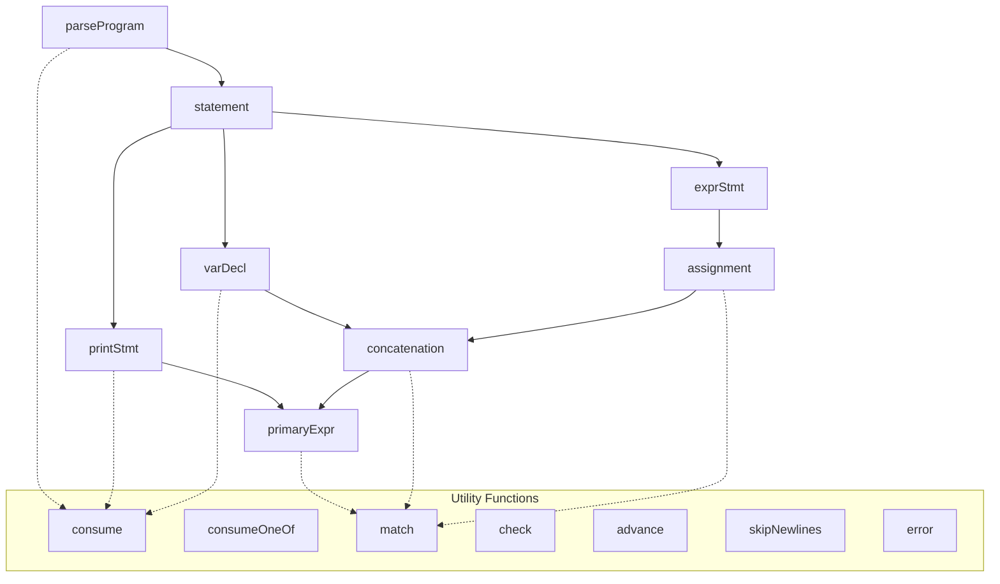

# Bisaya++ Parser — Function Reference

## Overview

This document provides a comprehensive function-level reference for the Bisaya++ Parser implementation. Each function includes its signature, purpose, behavior, inputs/outputs, side effects, and common debugging scenarios.

## Call Graph and Flow



## Function Categories

### 🏁 Entry Point Functions
- [`parseProgram()`](#parseprogram) - Main parsing entry point

### 📝 Statement Parsing Functions
- [`statement()`](#statement) - Statement dispatcher
- [`printStmt()`](#printstmt) - IPAKITA statement parser
- [`varDecl()`](#vardecl) - MUGNA declaration parser
- [`exprStmt()`](#exprstmt) - Expression statement wrapper

### 🧮 Expression Parsing Functions
- [`assignment()`](#assignment) - Assignment expression parser
- [`concatenation()`](#concatenation) - String concatenation parser
- [`primaryExpr()`](#primaryexpr) - Primary expression parser

### 🔧 Utility Functions
- [`consume()`](#consume) - Required token consumer
- [`consumeOneOf()`](#consumeoneof) - Multi-option token consumer
- [`match()`](#match) - Optional token matcher
- [`check()`](#check) - Token type checker
- [`checkNext()`](#checknext) - Lookahead checker
- [`advance()`](#advance) - Token stream navigator
- [`peek()`](#peek) - Current token getter
- [`previous()`](#previous) - Previous token getter
- [`isAtEnd()`](#isatend) - EOF checker
- [`skipNewlines()`](#skipnewlines) - Newline skipper

### ⚠️ Error Handling Functions
- [`error()`](#error) - Error reporter and exception creator

---

## Function Specifications

### Entry Point Functions

#### `parseProgram()`

**Signature:**
```java
public List<Stmt> parseProgram()
```

**Purpose:** Main entry point for parsing a complete Bisaya++ program

**Grammar:** `SUGOD statement* KATAPUSAN EOF`

**Behavior:**
1. Skips leading newlines
2. Consumes required `SUGOD` token
3. Parses zero or more statements until `KATAPUSAN`
4. Consumes required `KATAPUSAN` token
5. Validates no unexpected tokens remain

**Input:** Uses `this.tokens` field (token stream from lexer)

**Output:** `List<Stmt>` representing the parsed program

**Side Effects:**
- Advances `current` position through entire token stream
- Reports errors via `ErrorReporter` on syntax violations

**Throws:** `ParseError` for:
- Missing `SUGOD` at program start
- Missing `KATAPUSAN` at program end  
- Unexpected tokens after `KATAPUSAN`

**Debug Notes:**
- Check `current` position is 0 before calling
- Verify token stream ends with `EOF`
- Common failure: forgetting `SUGOD` or `KATAPUSAN`

**Example Usage:**
```java
List<Token> tokens = lexer.scanTokens();
Parser parser = new Parser(tokens);
List<Stmt> program = parser.parseProgram(); // Throws ParseError on invalid syntax
```

---

### Statement Parsing Functions

#### `statement()`

**Signature:**
```java
private Stmt statement()
```

**Purpose:** Dispatcher that determines statement type and delegates to appropriate parser

**Grammar:** `printStmt | varDecl | exprStmt`

**Behavior:**
1. Checks current token type
2. Dispatches to specific statement parser:
   - `IPAKITA` → `printStmt()`
   - `MUGNA` → `varDecl()`
   - Other → `exprStmt()`

**Input:** Current token via `peek()`

**Output:** `Stmt` AST node of appropriate subtype

**Side Effects:** Consumes tokens via delegated parsers

**Throws:** `ParseError` from delegated parsers

**Debug Notes:**
- Always advances at least one token
- Default case handles assignments and expressions
- Check token type with debugger to verify dispatch

---

#### `printStmt()`

**Signature:**
```java
private Stmt printStmt()
```

**Purpose:** Parses IPAKITA (print) statements with concatenated expressions

**Grammar:** `IPAKITA ":" expression ("&" expression)* ";"?`

**Behavior:**
1. Assumes `IPAKITA` already consumed by caller
2. Consumes required `:` token
3. Parses first expression (required)
4. Parses additional expressions separated by `&`
5. Optionally consumes `;` token

**Input:** Token stream positioned after `IPAKITA`

**Output:** `Stmt.Print` containing list of expressions

**Side Effects:** Advances through print statement tokens

**Throws:** `ParseError` for:
- Missing `:` after `IPAKITA`
- Invalid expressions in concatenation chain

**Debug Notes:**
- First expression is required, additional are optional
- Empty print statements not allowed: `IPAKITA:` is invalid
- Check `parts.size() >= 1` in result

**Example Parse:**
```bisaya
IPAKITA: "Hello" & " " & "World" & $
```
Creates `Stmt.Print` with 4 expression parts.

---

#### `varDecl()`

**Signature:**
```java
private Stmt varDecl()
```

**Purpose:** Parses MUGNA variable declarations with optional initializers

**Grammar:** `MUGNA type identifier ("=" expression)? ("," identifier ("=" expression)?)* ";"?`

**Behavior:**
1. Assumes `MUGNA` already consumed by caller
2. Consumes required type token (`NUMERO`/`LETRA`/`TINUOD`/`TIPIK`)
3. Parses comma-separated variable list
4. For each variable:
   - Consumes identifier
   - Optionally parses `= expression` initializer
5. Optionally consumes `;` token

**Input:** Token stream positioned after `MUGNA`

**Output:** `Stmt.VarDecl` with type and variable items

**Side Effects:** Advances through declaration tokens

**Throws:** `ParseError` for:
- Invalid type after `MUGNA`
- Missing variable names
- Invalid initializer expressions

**Debug Notes:**
- Multiple variables allowed: `MUGNA NUMERO x, y, z=5`
- Initializers optional but when present must be valid expressions
- Type applies to all variables in declaration

**Example Parse:**
```bisaya
MUGNA NUMERO x, y=5, z
```
Creates `Stmt.VarDecl` with `NUMERO` type and 3 items.

---

#### `exprStmt()`

**Signature:**
```java
private Stmt exprStmt()
```

**Purpose:** Wraps expressions as statements (mainly assignments)

**Grammar:** `assignment ";"?`

**Behavior:**
1. Parses assignment expression
2. Optionally consumes `;` token
3. Wraps expression in statement node

**Input:** Current token position

**Output:** `Stmt.ExprStmt` wrapping the expression

**Side Effects:** Advances through expression tokens

**Throws:** `ParseError` from expression parsing

**Debug Notes:**
- Used for assignments like `x = 5`
- Also handles bare expressions (though uncommon)
- Semicolon is always optional in Bisaya++

---

### Expression Parsing Functions

#### `assignment()`

**Signature:**
```java
private Expr assignment()
```

**Purpose:** Parses assignment expressions with right-associativity

**Grammar:** `IDENTIFIER "=" assignment | concatenation`

**Behavior:**
1. Parses left side as concatenation
2. If `=` found:
   - Recursively parses right side as assignment (right-associative)
   - Validates left side is variable
   - Creates assignment node
3. Otherwise returns concatenation result

**Input:** Current token position

**Output:** `Expr.Assign` or lower-precedence expression

**Side Effects:** Advances through assignment tokens

**Throws:** `ParseError` for invalid assignment targets

**Precedence:** Highest (level 1)

**Associativity:** Right (`x=y=4` → `x=(y=4)`)

**Debug Notes:**
- Assignment target must be simple variable
- Right-associativity achieved through recursion
- `5 = x` is invalid and throws error

**Example Parse:**
```bisaya
x = y = 10
```
Creates nested `Expr.Assign(x, Expr.Assign(y, 10))`.

---

#### `concatenation()`

**Signature:**
```java
private Expr concatenation()
```

**Purpose:** Parses string concatenation with left-associativity

**Grammar:** `primary ("&" primary)*`

**Behavior:**
1. Parses first primary expression
2. While `&` tokens found:
   - Consumes `&` operator
   - Parses right primary expression  
   - Creates binary expression node
   - Uses result as left side of next iteration

**Input:** Current token position

**Output:** `Expr.Binary` for concatenation or primary expression

**Side Effects:** Advances through concatenation tokens

**Throws:** `ParseError` from primary expression parsing

**Precedence:** Medium (level 2)

**Associativity:** Left (`"A"&"B"&"C"` → `("A"&"B")&"C"`)

**Debug Notes:**
- Left-associativity achieved through iteration
- Each `&` creates new `Expr.Binary` node
- Works with any primary expressions, not just strings

**Example Parse:**
```bisaya
"Hello" & " " & name
```
Creates `Expr.Binary(Expr.Binary("Hello", &, " "), &, name)`.

---

#### `primaryExpr()`

**Signature:**
```java
private Expr primaryExpr()
```

**Purpose:** Parses primary expressions (literals and variables)

**Grammar:** `STRING | NUMBER | CHAR | "$" | IDENTIFIER`

**Behavior:**
1. Checks current token type
2. For literals: creates `Expr.Literal` with token value
3. For `$`: creates `Expr.Literal` with newline `"\n"`
4. For identifiers: creates `Expr.Variable` with name
5. Throws error if no valid primary found

**Input:** Current token position

**Output:** `Expr.Literal` or `Expr.Variable`

**Side Effects:** Advances past consumed token

**Throws:** `ParseError` if no valid primary expression found

**Precedence:** Lowest (level 3)

**Debug Notes:**
- Terminal symbols in expression grammar
- `$` is special literal that becomes `"\n"`
- All other token types cause parse error

**Example Parses:**
```bisaya
"Hello"    → Expr.Literal("Hello")
42         → Expr.Literal(42.0)  
'c'        → Expr.Literal('c')
$          → Expr.Literal("\n")
variable   → Expr.Variable("variable")
```

---

### Utility Functions

#### `consume()`

**Signature:**
```java
private Token consume(TokenType type, String msg)
```

**Purpose:** Requires specific token type or throws error

**Behavior:**
1. Checks if current token matches expected type
2. If match: advances and returns token
3. If no match: throws error with custom message

**Input:**
- `type`: Required token type
- `msg`: Error message if token not found

**Output:** The consumed token

**Side Effects:** Advances `current` position if successful

**Throws:** `ParseError` if token type doesn't match

**Debug Notes:**
- Use when token is absolutely required
- Provides clear error messages for missing tokens
- Common in parsing fixed syntax elements

**Example Usage:**
```java
consume(TokenType.COLON, "Expect ':' after IPAKITA.");
```

---

#### `consumeOneOf()`

**Signature:**
```java
private Token consumeOneOf(String msg, TokenType... types)
```

**Purpose:** Requires one of several token types or throws error

**Behavior:**
1. Checks current token against each provided type
2. If any match: advances and returns token  
3. If none match: throws error with custom message

**Input:**
- `msg`: Error message if no types match
- `types`: Array of acceptable token types

**Output:** The consumed token

**Side Effects:** Advances `current` position if successful

**Throws:** `ParseError` if no token types match

**Debug Notes:**
- Useful for alternatives like type keywords
- Checks types in order provided
- More efficient than multiple `check()` calls

**Example Usage:**
```java
Token typeTok = consumeOneOf("Expect a type after MUGNA.", 
    TokenType.NUMERO, TokenType.LETRA, TokenType.TINUOD, TokenType.TIPIK);
```

---

#### `match()`

**Signature:**
```java
private boolean match(TokenType t)
```

**Purpose:** Optionally consumes token if type matches

**Behavior:**
1. Checks if current token matches type
2. If match: advances and returns `true`
3. If no match: returns `false` without advancing

**Input:** `t` - Token type to match

**Output:** `true` if consumed, `false` if not

**Side Effects:** May advance `current` position

**Throws:** Never throws

**Debug Notes:**
- Use for optional syntax elements
- Safe to call repeatedly
- Common in loops parsing repeated elements

**Example Usage:**
```java
if (match(TokenType.SEMICOLON)) {
    // Optional semicolon was present
}
```

---

#### `check()`

**Signature:**
```java
private boolean check(TokenType t)
```

**Purpose:** Tests current token type without consuming

**Behavior:**
1. Returns `false` if at end of stream
2. Otherwise compares current token type to parameter
3. Never advances token position

**Input:** `t` - Token type to check

**Output:** `true` if types match, `false` otherwise

**Side Effects:** None

**Throws:** Never throws

**Debug Notes:**
- Pure query function - no side effects
- Safe to call multiple times
- Use for lookahead and conditionals

**Example Usage:**
```java
if (check(TokenType.KATAPUSAN)) {
    // We're at program end
}
```

---

#### `advance()`

**Signature:**
```java
private Token advance()
```

**Purpose:** Moves to next token in stream

**Behavior:**
1. If not at end: increments `current` position
2. Returns the token that was current before advancing

**Input:** None (uses `current` field)

**Output:** The previous current token

**Side Effects:** Increments `current` position

**Throws:** Never throws (safe at EOF)

**Debug Notes:**
- Always safe to call
- Returns meaningful token even at EOF
- Used internally by other consumption functions

---

#### `peek()`

**Signature:**
```java
private Token peek()
```

**Purpose:** Returns current token without advancing

**Behavior:**
- Returns token at current position
- Never advances position

**Input:** None (uses `current` field)

**Output:** Current token

**Side Effects:** None

**Throws:** Never throws

**Debug Notes:**
- Most frequently called function
- Safe at any position including EOF
- Use for lookahead and token inspection

---

#### `previous()`

**Signature:**
```java
private Token previous()
```

**Purpose:** Returns previously consumed token

**Behavior:**
- Returns token at `current - 1` position
- Used to access token just consumed by `advance()`

**Input:** None (uses `current` field)

**Output:** Previous token

**Side Effects:** None

**Throws:** Never throws (assumes valid previous)

**Debug Notes:**
- Only meaningful after at least one `advance()`
- Used to get token value after consuming
- Common pattern: `match()` then `previous()`

---

#### `isAtEnd()`

**Signature:**
```java
private boolean isAtEnd()
```

**Purpose:** Tests if parsing has reached end of token stream

**Behavior:**
- Checks if current token is `EOF` type
- Used to control parsing loops

**Input:** None (uses current token)

**Output:** `true` if at EOF, `false` otherwise

**Side Effects:** None

**Throws:** Never throws

**Debug Notes:**
- EOF token should be last in stream
- Use in `while (!isAtEnd())` loops
- Lexer must provide EOF token

---

#### `skipNewlines()`

**Signature:**
```java
private void skipNewlines()
```

**Purpose:** Consumes any consecutive newline tokens

**Behavior:**
- Loops while current token is `NEWLINE`
- Advances past all newlines found
- Stops at first non-newline token

**Input:** None (uses current position)

**Output:** None (`void`)

**Side Effects:** May advance `current` position multiple times

**Throws:** Never throws

**Debug Notes:**
- Newlines are syntactic sugar in Bisaya++
- Called frequently to handle formatting
- Safe to call with no newlines present

---

### Error Handling Functions

#### `error()`

**Signature:**
```java
ParseError error(Token token, String message)
```

**Purpose:** Reports error and creates exception for throwing

**Behavior:**
1. Reports error to `ErrorReporter` with token position
2. Creates and returns new `ParseError` exception
3. Does not throw - caller must throw returned exception

**Input:**
- `token`: Token where error occurred (for position info)
- `message`: Descriptive error message

**Output:** `ParseError` exception ready to throw

**Side Effects:** Reports error to `ErrorReporter`

**Throws:** Never throws (returns exception)

**Debug Notes:**
- Always call like: `throw error(token, "message")`
- Token provides line/column for error reporting
- Use `peek()` token for current position errors

**Example Usage:**
```java
throw error(peek(), "Expect ';' after expression.");
```

---

## Common Debugging Scenarios

### 1. **Unexpected Token Errors**
```
Error: "Expect ':' after IPAKITA"
```
**Debug Steps:**
1. Check `peek().type` - what token is actually there?
2. Verify lexer produced correct tokens
3. Check if statement dispatcher called wrong parser

### 2. **Assignment Target Errors**
```  
Error: "Invalid assignment target"
```
**Debug Steps:**
1. Check left-hand side of assignment
2. Verify it's `Expr.Variable`, not literal or complex expression
3. Look for typos like `5 = x` instead of `x = 5`

### 3. **Missing Program Delimiters**
```
Error: "Program must start with SUGOD"
```
**Debug Steps:**
1. Check first token in stream
2. Verify lexer isn't skipping `SUGOD`
3. Look for comments or whitespace before `SUGOD`

### 4. **Infinite Loops in Expression Parsing**
**Symptoms:** Parser hangs without progress
**Debug Steps:**
1. Check `current` position - is it advancing?
2. Look for missing `advance()` calls in loops
3. Verify `isAtEnd()` checks in while conditions

### 5. **AST Structure Issues**
**Symptoms:** Interpreter produces wrong results
**Debug Steps:**
1. Print AST after parsing
2. Check operator precedence and associativity
3. Verify expression nesting matches expectations

## Integration with Other Components

### **From Lexer:**
- Receives `List<Token>` with `EOF` at end
- Expects tokens to include line/column information
- Relies on lexer for comment removal and whitespace handling

### **To Interpreter:**
- Provides `List<Stmt>` representing program structure
- AST nodes implement Visitor pattern for traversal
- Immutable nodes safe for multiple interpreter passes

### **Error Reporting:**
- Delegates to `ErrorReporter.error(line, col, message)`
- Provides precise error locations via token positions
- Uses panic-mode recovery (throw exception immediately)

## Performance Characteristics

- **Time Complexity:** O(n) - single pass through tokens
- **Space Complexity:** O(n) - AST storage proportional to input  
- **Recursion Depth:** Limited by expression nesting (potential stack overflow)
- **Memory Usage:** Dominated by AST node allocation

## Cross-References

- **Parser Specification:** [parser-specification.md](./parser-specification.md)
- **Lexer Functions:** [lexer-functions.md](./lexer-functions.md) 
- **Source Code:** `app/src/main/java/com/bisayapp/Parser.java`
- **AST Classes:** `app/src/main/java/com/bisayapp/{Stmt,Expr}.java`
- **Test Examples:** `app/src/test/java/com/bisayapp/ParserTest.java`
