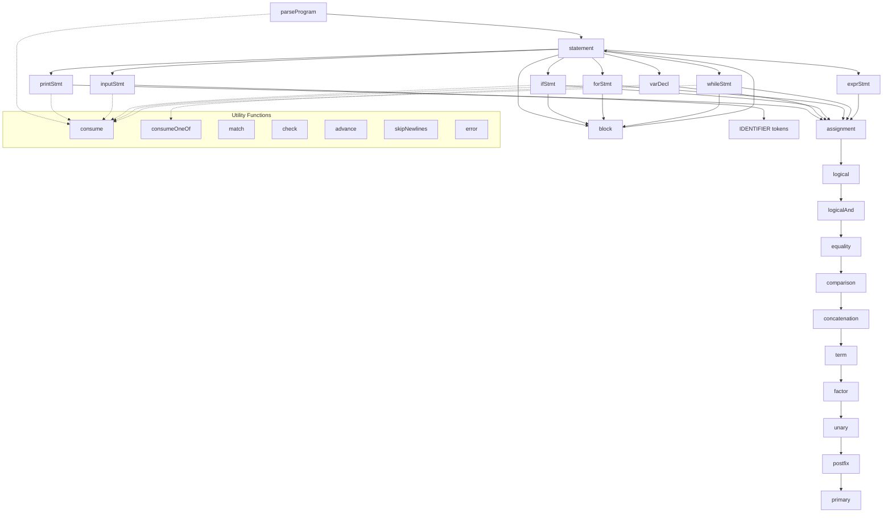

# Bisaya++ Parser — Function Reference

## Overview

This document provides a comprehensive function-level reference for the Bisaya++ Parser implementation. Each function includes its signature, purpose, behavior, inputs/outputs, side effects, and common debugging scenarios.

## Call Graph and Flow



## Function Categories

### Entry Point Functions
- [`parseProgram()`](#parseprogram) - Main parsing entry point

### Statement Parsing Functions
- [`statement()`](#statement) - Statement dispatcher
- [`printStmt()`](#printstmt) - IPAKITA statement parser
- [`inputStmt()`](#inputstmt) - DAWAT input statement parser
- [`varDecl()`](#vardecl) - MUGNA declaration parser
- [`ifStmt()`](#ifstmt) - KUNG conditional parser
- [`forStmt()`](#forstmt) - ALANG SA for loop parser
- [`whileStmt()`](#whilestmt) - SAMTANG while loop parser
- [`block()`](#block) - PUNDOK block parser
- [`exprStmt()`](#exprstmt) - Expression statement wrapper

### Expression Parsing Functions
- [`assignment()`](#assignment) - Assignment expression parser
- [`logical()`](#logical) - Logical OR parser
- [`logicalAnd()`](#logicaland) - Logical AND parser
- [`equality()`](#equality) - Equality comparison parser
- [`comparison()`](#comparison) - Relational comparison parser
- [`concatenation()`](#concatenation) - String concatenation parser
- [`term()`](#term) - Addition/subtraction parser
- [`factor()`](#factor) - Multiplication/division/modulo parser
- [`unary()`](#unary) - Prefix unary expression parser
- [`postfix()`](#postfix) - Postfix expression parser
- [`primary()`](#primary) - Primary expression parser

### Utility Functions
- [`consume()`](#consume) - Required token consumer
- [`consumeOneOf()`](#consumeoneof) - Multi-option token consumer
- [`match()`](#match) - Optional token matcher
- [`check()`](#check) - Token type checker
- [`checkNext()`](#checknext) - Lookahead checker
- [`advance()`](#advance) - Token stream navigator
- [`peek()`](#peek) - Current token getter
- [`previous()`](#previous) - Previous token getter
- [`isAtEnd()`](#isatend) - EOF checker
- [`skipNewlines()`](#skipnewlines) - Newline skipper

### Error Handling Functions
- [`error()`](#error) - Error reporter and exception creator

---

## Function Specifications

### Entry Point Functions

#### `parseProgram()`

**Signature:**
```java
public List<Stmt> parseProgram()
```

**Purpose:** Main entry point for parsing a complete Bisaya++ program

**Grammar:** `SUGOD statement* KATAPUSAN EOF`

**Behavior:**
1. Skips leading newlines
2. Consumes required `SUGOD` token
3. Parses zero or more statements until `KATAPUSAN`
4. Consumes required `KATAPUSAN` token
5. Validates no unexpected tokens remain

**Input:** Uses `this.tokens` field (token stream from lexer)

**Output:** `List<Stmt>` representing the parsed program

**Side Effects:**
- Advances `current` position through entire token stream
- Reports errors via `ErrorReporter` on syntax violations

**Throws:** `ParseError` for:
- Missing `SUGOD` at program start
- Missing `KATAPUSAN` at program end  
- Unexpected tokens after `KATAPUSAN`

**Debug Notes:**
- Check `current` position is 0 before calling
- Verify token stream ends with `EOF`
- Common failure: forgetting `SUGOD` or `KATAPUSAN`

**Example Usage:**
```java
List<Token> tokens = lexer.scanTokens();
Parser parser = new Parser(tokens);
List<Stmt> program = parser.parseProgram(); // Throws ParseError on invalid syntax
```

---

### Statement Parsing Functions

#### `statement()`

**Signature:**
```java
private Stmt statement()
```

**Purpose:** Dispatcher that determines statement type and delegates to appropriate parser

**Grammar:** `printStmt | inputStmt | varDecl | ifStmt | forStmt | whileStmt | block | exprStmt`

**Behavior:**
1. Checks current token type
2. Dispatches to specific statement parser:
   - `IPAKITA` → `printStmt()`
   - `DAWAT` → `inputStmt()`
   - `MUGNA` → `varDecl()`
   - `KUNG` → `ifStmt()`
   - `ALANG` → `forStmt()`
   - `SAMTANG` → `whileStmt()`
   - `PUNDOK` → `block()`
   - Other → `exprStmt()`

**Input:** Current token via `peek()`

**Output:** `Stmt` AST node of appropriate subtype

**Side Effects:** Consumes tokens via delegated parsers

**Throws:** `ParseError` from delegated parsers

**Debug Notes:**
- Always advances at least one token
- Default case handles assignments and expressions
- Check token type with debugger to verify dispatch

---

#### `printStmt()`

**Signature:**
```java
private Stmt printStmt()
```

**Purpose:** Parses IPAKITA (print) statements with concatenated expressions

**Grammar:** `IPAKITA ":" expression ("&" expression)*`

**Behavior:**
1. Assumes `IPAKITA` already consumed by caller
2. Consumes required `:` token
3. Parses first expression (required)
4. Parses additional expressions separated by `&`
5. Validates no unexpected tokens follow (semicolons cause errors)

**Input:** Token stream positioned after `IPAKITA`

**Output:** `Stmt.Print` containing list of expressions

**Side Effects:** Advances through print statement tokens

**Throws:** `ParseError` for:
- Missing `:` after `IPAKITA`
- Invalid expressions in concatenation chain
- Semicolons after statement (not allowed in Bisaya++)

**Debug Notes:**
- First expression is required, additional are optional
- Empty print statements not allowed: `IPAKITA:` is invalid
- Check `parts.size() >= 1` in result

**Example Parse:**
```bisaya
IPAKITA: "Hello" & " " & "World" & $
```
Creates `Stmt.Print` with 4 expression parts.

---

#### `varDecl()`

**Signature:**
```java
private Stmt varDecl()
```

**Purpose:** Parses MUGNA variable declarations with optional initializers

**Grammar:** `MUGNA type identifier ("=" expression)? ("," identifier ("=" expression)?)*`

**Behavior:**
1. Assumes `MUGNA` already consumed by caller
2. Consumes required type token (`NUMERO`/`LETRA`/`TINUOD`/`TIPIK`)
3. Parses comma-separated variable list
4. For each variable:
   - Consumes identifier
   - Optionally parses `= expression` initializer
5. Validates no semicolons follow (causes error)

**Input:** Token stream positioned after `MUGNA`

**Output:** `Stmt.VarDecl` with type and variable items

**Side Effects:** Advances through declaration tokens

**Throws:** `ParseError` for:
- Invalid type after `MUGNA`
- Missing variable names
- Invalid initializer expressions
- Semicolons after declaration (not allowed in Bisaya++)

**Debug Notes:**
- Multiple variables allowed: `MUGNA NUMERO x, y, z=5`
- Initializers optional but when present must be valid expressions
- Type applies to all variables in declaration

**Example Parse:**
```bisaya
MUGNA NUMERO x, y=5, z
```
Creates `Stmt.VarDecl` with `NUMERO` type and 3 items.

---

#### `exprStmt()`

**Signature:**
```java
private Stmt exprStmt()
```

**Purpose:** Wraps expressions as statements (mainly assignments)

**Grammar:** `assignment`

**Behavior:**
1. Parses assignment expression
2. Validates no semicolons follow (causes error)
3. Wraps expression in statement node

**Input:** Current token position

**Output:** `Stmt.ExprStmt` wrapping the expression

**Side Effects:** Advances through expression tokens

**Throws:** `ParseError` from expression parsing

**Debug Notes:**
- Used for assignments like `x = 5`
- Also handles bare expressions (though uncommon)
- Semicolons are not allowed and cause parse errors

---

#### `inputStmt()`

**Signature:**
```java
private Stmt inputStmt()
```

**Purpose:** Parses DAWAT (input) statements with variable validation

**Grammar:** `DAWAT ":" identifier ("," identifier)*`

**Behavior:**
1. Assumes `DAWAT` already consumed by caller
2. Consumes required `:` token
3. Parses first variable (required)
4. Validates variable is declared
5. Parses additional variables separated by commas
6. Checks for duplicate variables in same DAWAT statement
7. Validates no unexpected tokens follow

**Input:** Token stream positioned after `DAWAT`

**Output:** `Stmt.Input` with list of variable names

**Side Effects:** Advances through input statement tokens

**Throws:** `ParseError` for:
- Missing `:` after `DAWAT`
- Undefined variables
- Duplicate variables in same statement
- Invalid tokens after variable list

**Debug Notes:**
- Variables must be declared before use in DAWAT
- Multiple variables: `DAWAT: x, y, z`
- Validates existence during parsing (early error detection)

**Example Parse:**
```bisaya
DAWAT: x, y
```
Creates `Stmt.Input` with varNames=["x", "y"]

---

#### `ifStmt()`

**Signature:**
```java
private Stmt ifStmt()
```

**Purpose:** Parses KUNG conditional statements with optional else/else-if

**Grammar:**
```
KUNG "(" expression ")" PUNDOK "{" statement* "}"
("KUNG" "DILI" "(" expression ")" PUNDOK "{" statement* "}")*
("KUNG" "WALA" PUNDOK "{" statement* "}")?
```

**Behavior:**
1. Assumes `KUNG` already consumed by caller
2. Consumes `(` condition `)`
3. Consumes `PUNDOK {` and parses block
4. Checks for `KUNG DILI` (else-if) chains
5. Checks for `KUNG WALA` (else) clause
6. Builds nested If nodes for else-if chains

**Input:** Token stream positioned after `KUNG`

**Output:** `Stmt.If` with condition, then branch, and optional else branch

**Side Effects:** Advances through conditional tokens

**Throws:** `ParseError` for:
- Missing parentheses around condition
- Missing `PUNDOK {` block markers
- Malformed else-if/else clauses

**Debug Notes:**
- Else-if chains are right-associative (nested If in else branch)
- Multiple `KUNG DILI` allowed
- Only one `KUNG WALA` allowed at the end

**Example Parse:**
```bisaya
KUNG (x > 5)
PUNDOK{ IPAKITA: "big" }
KUNG DILI (x > 0)
PUNDOK{ IPAKITA: "positive" }
KUNG WALA
PUNDOK{ IPAKITA: "non-positive" }
```

---

#### `forStmt()`

**Signature:**
```java
private Stmt forStmt()
```

**Purpose:** Parses ALANG SA (for loop) statements

**Grammar:** `ALANG SA "(" assignment "," expression "," assignment ")" PUNDOK "{" statement* "}"`

**Behavior:**
1. Assumes `ALANG` already consumed by caller
2. Consumes `SA` keyword
3. Consumes `(`
4. Parses initializer as assignment
5. Consumes `,` and parses condition expression
6. Consumes `,` and parses update as assignment
7. Consumes `)`
8. Parses loop body as block

**Input:** Token stream positioned after `ALANG`

**Output:** `Stmt.For` with initializer, condition, update, and body

**Side Effects:** Advances through loop tokens

**Throws:** `ParseError` for:
- Missing `SA` keyword
- Missing parentheses or commas
- Invalid initializer/condition/update
- Missing `PUNDOK {` block

**Debug Notes:**
- All three parts (init, condition, update) are required
- Initializer and update must be assignments
- Condition is any expression (usually comparison)

**Example Parse:**
```bisaya
ALANG SA (ctr=1, ctr<=10, ctr++)
PUNDOK{ IPAKITA: ctr & $ }
```

---

#### `whileStmt()`

**Signature:**
```java
private Stmt whileStmt()
```

**Purpose:** Parses SAMTANG (while loop) statements

**Grammar:** `SAMTANG "(" expression ")" PUNDOK "{" statement* "}"`

**Behavior:**
1. Assumes `SAMTANG` already consumed by caller
2. Consumes `(` condition `)`
3. Parses loop body as block

**Input:** Token stream positioned after `SAMTANG`

**Output:** `Stmt.While` with condition and body

**Side Effects:** Advances through loop tokens

**Throws:** `ParseError` for:
- Missing parentheses around condition
- Invalid condition expression
- Missing `PUNDOK {` block

**Debug Notes:**
- Simpler than for loop (only condition)
- Body must be PUNDOK block
- Condition evaluated before each iteration

**Example Parse:**
```bisaya
SAMTANG (x > 0)
PUNDOK{ x = x - 1 }
```

---

#### `block()`

**Signature:**
```java
private Stmt block()
```

**Purpose:** Parses PUNDOK block statements

**Grammar:** `"{" statement* "}"`

**Behavior:**
1. Assumes `PUNDOK` already consumed by caller
2. Consumes `{`
3. Parses zero or more statements until `}`
4. Consumes `}`

**Input:** Token stream positioned after `PUNDOK`

**Output:** `Stmt.Block` containing list of statements

**Side Effects:** Advances through block tokens

**Throws:** `ParseError` for:
- Missing opening `{`
- Missing closing `}`
- Invalid statements inside block

**Debug Notes:**
- Empty blocks are allowed
- Used in if/loop bodies
- Statements parsed via recursive `statement()` calls

**Example Parse:**
```bisaya
PUNDOK{
    MUGNA NUMERO x=5
    IPAKITA: x
}
```

---

### Expression Parsing Functions

#### `assignment()`

**Signature:**
```java
private Expr assignment()
```

**Purpose:** Parses assignment expressions with right-associativity

**Grammar:** `IDENTIFIER "=" assignment | concatenation`

**Behavior:**
1. Parses left side as concatenation
2. If `=` found:
   - Recursively parses right side as assignment (right-associative)
   - Validates left side is variable
   - Creates assignment node
3. Otherwise returns concatenation result

**Input:** Current token position

**Output:** `Expr.Assign` or lower-precedence expression

**Side Effects:** Advances through assignment tokens

**Throws:** `ParseError` for invalid assignment targets

**Precedence:** Highest (level 1)

**Associativity:** Right (`x=y=4` → `x=(y=4)`)

**Debug Notes:**
- Assignment target must be simple variable
- Right-associativity achieved through recursion
- `5 = x` is invalid and throws error

**Example Parse:**
```bisaya
x = y = 10
```
Creates nested `Expr.Assign(x, Expr.Assign(y, 10))`.

---

#### `logical()`

**Signature:**
```java
private Expr logical()
```

**Purpose:** Parses logical OR expressions with left-associativity

**Grammar:** `logicalAnd ("O" logicalAnd)*`

**Behavior:**
1. Parses first AND expression
2. While `O` tokens found, creates Binary nodes
3. Left-associative iteration

**Input:** Current token position

**Output:** `Expr.Binary` for OR or lower-precedence expression

**Precedence:** Level 2

**Associativity:** Left

**Example:** `a UG b O c UG d` → `((a UG b) O (c UG d))`

---

#### `logicalAnd()`

**Signature:**
```java
private Expr logicalAnd()
```

**Purpose:** Parses logical AND expressions with left-associativity

**Grammar:** `equality ("UG" equality)*`

**Behavior:**
1. Parses first equality expression
2. While `UG` tokens found, creates Binary nodes
3. Left-associative iteration

**Input:** Current token position

**Output:** `Expr.Binary` for AND or lower-precedence expression

**Precedence:** Level 3

**Associativity:** Left

**Example:** `a == b UG c > d` → `((a == b) UG (c > d))`

---

#### `equality()`

**Signature:**
```java
private Expr equality()
```

**Purpose:** Parses equality/inequality comparisons

**Grammar:** `comparison (("==" | "<>") comparison)*`

**Behavior:**
1. Parses first comparison expression
2. While `==` or `<>` found, creates Binary nodes
3. Left-associative iteration

**Input:** Current token position

**Output:** `Expr.Binary` for equality or lower-precedence expression

**Precedence:** Level 4

**Associativity:** Left

**Example:** `a == b <> c` → `((a == b) <> c)`

---

#### `comparison()`

**Signature:**
```java
private Expr comparison()
```

**Purpose:** Parses relational comparisons

**Grammar:** `concatenation ((">" | ">=" | "<" | "<=") concatenation)*`

**Behavior:**
1. Parses first concatenation expression
2. While relational operators found, creates Binary nodes
3. Left-associative iteration

**Input:** Current token position

**Output:** `Expr.Binary` for comparison or lower-precedence expression

**Precedence:** Level 5

**Associativity:** Left

**Example:** `a > b < c` → `((a > b) < c)`

---

#### `concatenation()`

**Signature:**
```java
private Expr concatenation()
```

**Purpose:** Parses string concatenation with left-associativity

**Grammar:** `term ("&" term)*`

**Behavior:**
1. Parses first term expression
2. While `&` tokens found:
   - Consumes `&` operator
   - Parses right term expression  
   - Creates binary expression node
   - Uses result as left side of next iteration

**Input:** Current token position

**Output:** `Expr.Binary` for concatenation or lower-precedence expression

**Side Effects:** Advances through concatenation tokens

**Throws:** `ParseError` from term expression parsing

**Precedence:** Level 6

**Associativity:** Left (`"A"&"B"&"C"` → `("A"&"B")&"C"`)

**Debug Notes:**
- Left-associativity achieved through iteration
- Each `&` creates new `Expr.Binary` node
- Works with any term expressions, not just strings

**Example Parse:**
```bisaya
"Hello" & " " & name
```
Creates `Expr.Binary(Expr.Binary("Hello", &, " "), &, name)`.

---

#### `term()`

**Signature:**
```java
private Expr term()
```

**Purpose:** Parses addition and subtraction operations

**Grammar:** `factor (("+" | "-") factor)*`

**Behavior:**
1. Parses first factor expression
2. While `+` or `-` found, creates Binary nodes
3. Left-associative iteration

**Input:** Current token position

**Output:** `Expr.Binary` for addition/subtraction or lower-precedence expression

**Precedence:** Level 7

**Associativity:** Left

**Example:** `a + b - c` → `((a + b) - c)`

---

#### `factor()`

**Signature:**
```java
private Expr factor()
```

**Purpose:** Parses multiplication, division, and modulo operations

**Grammar:** `unary (("*" | "/" | "%") unary)*`

**Behavior:**
1. Parses first unary expression
2. While `*`, `/`, or `%` found, creates Binary nodes
3. Left-associative iteration

**Input:** Current token position

**Output:** `Expr.Binary` for multiplication/division/modulo or lower-precedence expression

**Precedence:** Level 8

**Associativity:** Left

**Example:** `a * b / c % d` → `(((a * b) / c) % d)`

---

#### `unary()`

**Signature:**
```java
private Expr unary()
```

**Purpose:** Parses prefix unary expressions

**Grammar:** `("+" | "-" | "++" | "--" | "DILI") unary | postfix`

**Behavior:**
1. If unary operator found:
   - Consumes operator
   - Recursively parses unary operand
   - Creates Unary node
2. Otherwise parses postfix expression

**Input:** Current token position

**Output:** `Expr.Unary` or postfix expression

**Precedence:** Level 9

**Associativity:** Right (via recursion)

**Operators:**
- `+` - Unary positive
- `-` - Unary negative (negation)
- `++` - Pre-increment
- `--` - Pre-decrement
- `DILI` - Logical NOT

**Example:** `--x` → `Unary(--, Variable(x))`

---

#### `postfix()`

**Signature:**
```java
private Expr postfix()
```

**Purpose:** Parses postfix unary expressions

**Grammar:** `primary ("++" | "--")*`

**Behavior:**
1. Parses primary expression
2. While `++` or `--` found:
   - Creates Postfix node
   - Uses result for next iteration

**Input:** Current token position

**Output:** `Expr.Postfix` or primary expression

**Precedence:** Level 10

**Associativity:** Left

**Operators:**
- `++` - Post-increment
- `--` - Post-decrement

**Example:** `x++` → `Postfix(Variable(x), ++)`

---

#### `primary()`

**Signature:**
```java
private Expr primary()
```

**Purpose:** Parses primary expressions (literals, variables, and grouping)

**Grammar:** `STRING | NUMBER | CHAR | "$" | "(" assignment ")" | IDENTIFIER`

**Behavior:**
1. Checks current token type
2. For literals: creates `Expr.Literal` with token value
3. For `$`: creates `Expr.Literal` with newline `"\n"`
4. For `(`: parses grouped expression, consumes `)`
5. For identifiers: creates `Expr.Variable` with name and token
6. Throws error if no valid primary found

**Input:** Current token position

**Output:** `Expr.Literal`, `Expr.Variable`, or `Expr.Grouping`

**Side Effects:** Advances past consumed tokens

**Throws:** `ParseError` if no valid primary expression found

**Precedence:** Level 11 (lowest/highest priority)

**Debug Notes:**
- Terminal symbols in expression grammar
- `$` is special literal that becomes `"\n"`
- Parentheses enable precedence override
- Variable nodes include token for error reporting
- All other token types cause parse error

**Example Parses:**
```bisaya
"Hello"    → Expr.Literal("Hello")
42         → Expr.Literal(42.0)  
'c'        → Expr.Literal('c')
$          → Expr.Literal("\n")
variable   → Expr.Variable("variable")
```

---

### Utility Functions

#### `consume()`

**Signature:**
```java
private Token consume(TokenType type, String msg)
```

**Purpose:** Requires specific token type or throws error

**Behavior:**
1. Checks if current token matches expected type
2. If match: advances and returns token
3. If no match: throws error with custom message

**Input:**
- `type`: Required token type
- `msg`: Error message if token not found

**Output:** The consumed token

**Side Effects:** Advances `current` position if successful

**Throws:** `ParseError` if token type doesn't match

**Debug Notes:**
- Use when token is absolutely required
- Provides clear error messages for missing tokens
- Common in parsing fixed syntax elements

**Example Usage:**
```java
consume(TokenType.COLON, "Expect ':' after IPAKITA.");
```

---

#### `consumeOneOf()`

**Signature:**
```java
private Token consumeOneOf(String msg, TokenType... types)
```

**Purpose:** Requires one of several token types or throws error

**Behavior:**
1. Checks current token against each provided type
2. If any match: advances and returns token  
3. If none match: throws error with custom message

**Input:**
- `msg`: Error message if no types match
- `types`: Array of acceptable token types

**Output:** The consumed token

**Side Effects:** Advances `current` position if successful

**Throws:** `ParseError` if no token types match

**Debug Notes:**
- Useful for alternatives like type keywords
- Checks types in order provided
- More efficient than multiple `check()` calls

**Example Usage:**
```java
Token typeTok = consumeOneOf("Expect a type after MUGNA.", 
    TokenType.NUMERO, TokenType.LETRA, TokenType.TINUOD, TokenType.TIPIK);
```

---

#### `match()`

**Signature:**
```java
private boolean match(TokenType t)
```

**Purpose:** Optionally consumes token if type matches

**Behavior:**
1. Checks if current token matches type
2. If match: advances and returns `true`
3. If no match: returns `false` without advancing

**Input:** `t` - Token type to match

**Output:** `true` if consumed, `false` if not

**Side Effects:** May advance `current` position

**Throws:** Never throws

**Debug Notes:**
- Use for optional syntax elements
- Safe to call repeatedly
- Common in loops parsing repeated elements

**Example Usage:**
```java
if (match(TokenType.SEMICOLON)) {
    // Optional semicolon was present
}
```

---

#### `check()`

**Signature:**
```java
private boolean check(TokenType t)
```

**Purpose:** Tests current token type without consuming

**Behavior:**
1. Returns `false` if at end of stream
2. Otherwise compares current token type to parameter
3. Never advances token position

**Input:** `t` - Token type to check

**Output:** `true` if types match, `false` otherwise

**Side Effects:** None

**Throws:** Never throws

**Debug Notes:**
- Pure query function - no side effects
- Safe to call multiple times
- Use for lookahead and conditionals

**Example Usage:**
```java
if (check(TokenType.KATAPUSAN)) {
    // We're at program end
}
```

---

#### `advance()`

**Signature:**
```java
private Token advance()
```

**Purpose:** Moves to next token in stream

**Behavior:**
1. If not at end: increments `current` position
2. Returns the token that was current before advancing

**Input:** None (uses `current` field)

**Output:** The previous current token

**Side Effects:** Increments `current` position

**Throws:** Never throws (safe at EOF)

**Debug Notes:**
- Always safe to call
- Returns meaningful token even at EOF
- Used internally by other consumption functions

---

#### `peek()`

**Signature:**
```java
private Token peek()
```

**Purpose:** Returns current token without advancing

**Behavior:**
- Returns token at current position
- Never advances position

**Input:** None (uses `current` field)

**Output:** Current token

**Side Effects:** None

**Throws:** Never throws

**Debug Notes:**
- Most frequently called function
- Safe at any position including EOF
- Use for lookahead and token inspection

---

#### `previous()`

**Signature:**
```java
private Token previous()
```

**Purpose:** Returns previously consumed token

**Behavior:**
- Returns token at `current - 1` position
- Used to access token just consumed by `advance()`

**Input:** None (uses `current` field)

**Output:** Previous token

**Side Effects:** None

**Throws:** Never throws (assumes valid previous)

**Debug Notes:**
- Only meaningful after at least one `advance()`
- Used to get token value after consuming
- Common pattern: `match()` then `previous()`

---

#### `isAtEnd()`

**Signature:**
```java
private boolean isAtEnd()
```

**Purpose:** Tests if parsing has reached end of token stream

**Behavior:**
- Checks if current token is `EOF` type
- Used to control parsing loops

**Input:** None (uses current token)

**Output:** `true` if at EOF, `false` otherwise

**Side Effects:** None

**Throws:** Never throws

**Debug Notes:**
- EOF token should be last in stream
- Use in `while (!isAtEnd())` loops
- Lexer must provide EOF token

---

#### `skipNewlines()`

**Signature:**
```java
private void skipNewlines()
```

**Purpose:** Consumes any consecutive newline tokens

**Behavior:**
- Loops while current token is `NEWLINE`
- Advances past all newlines found
- Stops at first non-newline token

**Input:** None (uses current position)

**Output:** None (`void`)

**Side Effects:** May advance `current` position multiple times

**Throws:** Never throws

**Debug Notes:**
- Newlines are syntactic sugar in Bisaya++
- Called frequently to handle formatting
- Safe to call with no newlines present

---

### Error Handling Functions

#### `error()`

**Signature:**
```java
ParseError error(Token token, String message)
```

**Purpose:** Reports error and creates exception for throwing

**Behavior:**
1. Reports error to `ErrorReporter` with token position
2. Creates and returns new `ParseError` exception
3. Does not throw - caller must throw returned exception

**Input:**
- `token`: Token where error occurred (for position info)
- `message`: Descriptive error message

**Output:** `ParseError` exception ready to throw

**Side Effects:** Reports error to `ErrorReporter`

**Throws:** Never throws (returns exception)

**Debug Notes:**
- Always call like: `throw error(token, "message")`
- Token provides line/column for error reporting
- Use `peek()` token for current position errors

**Example Usage:**
```java
throw error(peek(), "Expect ';' after expression.");
```

---

## Common Debugging Scenarios

### 1. **Unexpected Token Errors**
```
Error: "Expect ':' after IPAKITA"
```
**Debug Steps:**
1. Check `peek().type` - what token is actually there?
2. Verify lexer produced correct tokens
3. Check if statement dispatcher called wrong parser

### 2. **Assignment Target Errors**
```  
Error: "Invalid assignment target"
```
**Debug Steps:**
1. Check left-hand side of assignment
2. Verify it's `Expr.Variable`, not literal or complex expression
3. Look for typos like `5 = x` instead of `x = 5`

### 3. **Missing Program Delimiters**
```
Error: "Program must start with SUGOD"
```
**Debug Steps:**
1. Check first token in stream
2. Verify lexer isn't skipping `SUGOD`
3. Look for comments or whitespace before `SUGOD`

### 4. **Infinite Loops in Expression Parsing**
**Symptoms:** Parser hangs without progress
**Debug Steps:**
1. Check `current` position - is it advancing?
2. Look for missing `advance()` calls in loops
3. Verify `isAtEnd()` checks in while conditions

### 5. **AST Structure Issues**
**Symptoms:** Interpreter produces wrong results
**Debug Steps:**
1. Print AST after parsing
2. Check operator precedence and associativity
3. Verify expression nesting matches expectations

## Integration with Other Components

### **From Lexer:**
- Receives `List<Token>` with `EOF` at end
- Expects tokens to include line/column information
- Relies on lexer for comment removal and whitespace handling

### **To Interpreter:**
- Provides `List<Stmt>` representing program structure
- AST nodes implement Visitor pattern for traversal
- Immutable nodes safe for multiple interpreter passes

### **Error Reporting:**
- Delegates to `ErrorReporter.error(line, col, message)`
- Provides precise error locations via token positions
- Uses panic-mode recovery (throw exception immediately)

## Performance Characteristics

- **Time Complexity:** O(n) - single pass through tokens
- **Space Complexity:** O(n) - AST storage proportional to input  
- **Recursion Depth:** Limited by expression nesting (potential stack overflow)
- **Memory Usage:** Dominated by AST node allocation

## Cross-References

- **Parser Specification:** [parser-specification.md](./parser-specification.md)
- **Lexer Functions:** [lexer-functions.md](./lexer-functions.md) 
- **Source Code:** `app/src/main/java/com/bisayapp/Parser.java`
- **AST Classes:** `app/src/main/java/com/bisayapp/{Stmt,Expr}.java`
- **Test Examples:** `app/src/test/java/com/bisayapp/ParserTest.java`
