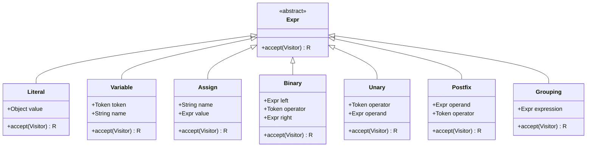

# Bisaya++ Parser Technical Specification

## Overview

The Parser (Syntax Analyzer) is the second component of the Bisaya++ interpreter responsible for converting a sequence of tokens into an Abstract Syntax Tree (AST). It performs syntax analysis by organizing tokens according to the Bisaya++ language grammar rules and constructs AST nodes that represent the program structure.

## Architecture

### Component Diagram


### Key Classes and Responsibilities

- **Parser**: Main syntax analyzer implementing recursive descent
- **Stmt**: Abstract base class for statement AST nodes
- **Expr**: Abstract base class for expression AST nodes
- **ParseError**: Custom exception for syntax errors

## Grammar Specification (BNF)

### Program Structure
```bnf
program        → SUGOD statement* KATAPUSAN EOF

statement      → printStmt | inputStmt | varDecl | ifStmt | forStmt 
                 | whileStmt | block | exprStmt

printStmt      → IPAKITA ":" expression ( "&" expression )*

inputStmt      → DAWAT ":" identifier ( "," identifier )*

varDecl        → MUGNA type identifier ( "=" expression )? 
                 ( "," identifier ( "=" expression )? )*

ifStmt         → KUNG "(" expression ")" PUNDOK "{" statement* "}"
                 ( KUNG DILI "(" expression ")" PUNDOK "{" statement* "}" )*
                 ( KUNG WALA PUNDOK "{" statement* "}" )?

forStmt        → ALANG SA "(" assignment "," expression "," assignment ")"
                 PUNDOK "{" statement* "}"

whileStmt      → SAMTANG "(" expression ")" PUNDOK "{" statement* "}"

block          → PUNDOK "{" statement* "}"

exprStmt       → assignment

type           → NUMERO | LETRA | TINUOD | TIPIK
```

### Expressions (Complete - All Increments)
```bnf
assignment     → IDENTIFIER "=" assignment | logical

logical        → logicalAnd ( "O" logicalAnd )*

logicalAnd     → equality ( "UG" equality )*

equality       → comparison ( ( "==" | "<>" ) comparison )*

comparison     → concatenation ( ( ">" | ">=" | "<" | "<=" ) concatenation )*

concatenation  → term ( "&" term )*

term           → factor ( ( "+" | "-" ) factor )*

factor         → unary ( ( "*" | "/" | "%" ) unary )*

unary          → ( "+" | "-" | "++" | "--" | "DILI" ) unary | postfix

postfix        → primary ( "++" | "--" )*

primary        → NUMBER | STRING | CHAR | "$" 
                 | "(" assignment ")" | IDENTIFIER
```

### Operator Precedence (Lowest to Highest)

| Level | Operators | Associativity | Category |
|-------|-----------|---------------|----------|
| 1 | `=` | Right | Assignment |
| 2 | `O` | Left | Logical OR |
| 3 | `UG` | Left | Logical AND |
| 4 | `==` `<>` | Left | Equality |
| 5 | `>` `>=` `<` `<=` | Left | Comparison |
| 6 | `&` | Left | Concatenation |
| 7 | `+` `-` | Left | Addition/Subtraction |
| 8 | `*` `/` `%` | Left | Multiplication/Division/Modulo |
| 9 | `+` `-` `++` `--` `DILI` | Right | Unary (prefix) |
| 10 | `++` `--` | Left | Postfix |
| 11 | `()` literals identifiers | N/A | Primary |

**Note on Precedence Levels**: 
- **Lower level number = LOWER precedence** (binds looser, evaluated last)
- **Higher level number = HIGHER precedence** (binds tighter, evaluated first)
- Level 1 (Assignment) has the **lowest** precedence
- Level 11 (Primary) has the **highest** precedence
- The levels correspond to the BNF grammar hierarchy from top to bottom

### Terminals
```bnf
IDENTIFIER     → [a-zA-Z_][a-zA-Z0-9_]*
STRING         → '"' [^"]* '"'
NUMBER         → [0-9]+ ( "." [0-9]+ )?
CHAR           → "'" [^'] "'"
```

## AST Node Hierarchy

### Statement Nodes (Stmt)


#### Statement Node Details

**Stmt.Print**: Represents `IPAKITA` output statements
- `parts`: List of expressions to concatenate and display
- Used for: `IPAKITA: "Hello" & $ & "World"`

**Stmt.Input**: Represents `DAWAT` input statements
- `dawatToken`: Token for error reporting
- `varNames`: List of variable names to receive input
- Used for: `DAWAT: x, y, z`

**Stmt.VarDecl**: Represents `MUGNA` variable declarations
- `type`: Token type (NUMERO, LETRA, TINUOD, TIPIK)
- `items`: List of variable declaration items with optional initializers
- Used for: `MUGNA NUMERO x, y=5, z`

**Stmt.If**: Represents `KUNG` conditional statements
- `condition`: Boolean expression to evaluate
- `thenBranch`: Statement to execute if true
- `elseBranch`: Optional else/else-if branch
- Used for: `KUNG (x > 5) PUNDOK{ ... } KUNG WALA PUNDOK{ ... }`

**Stmt.Block**: Represents `PUNDOK` block statements
- `statements`: List of statements in the block
- Used for: `PUNDOK{ statement1 statement2 ... }`

**Stmt.For**: Represents `ALANG SA` for loops
- `initializer`: Assignment statement (e.g., `ctr=1`)
- `condition`: Loop condition expression
- `update`: Update statement (e.g., `ctr++`)
- `body`: Loop body block
- Used for: `ALANG SA (ctr=1, ctr<=10, ctr++) PUNDOK{ ... }`

**Stmt.While**: Represents `SAMTANG` while loops
- `condition`: Loop condition expression
- `body`: Loop body block
- Used for: `SAMTANG (ctr <= 5) PUNDOK{ ... }`

**Stmt.ExprStmt**: Wrapper for expressions used as statements
- `expr`: The expression (typically assignments)
- Used for: `x = 5` or `y = z = 10`

### Expression Nodes (Expr)



#### Expression Node Details

**Expr.Literal**: Constant values
- `value`: The literal value (String, Number, Character, Boolean)
- Used for: `42`, `"Hello"`, `'a'`, `"\n"` (from `$`)

**Expr.Variable**: Variable references
- `token`: Token for error reporting with line/column info
- `name`: Variable identifier
- Used for: `x`, `counter`, `total_sum`

**Expr.Assign**: Assignment expressions
- `name`: Target variable name
- `value`: Expression to assign
- Used for: `x = 5`, `y = z = 10` (right-associative)

**Expr.Binary**: Binary operations
- `left`: Left operand expression
- `operator`: Operator token (`+`, `-`, `*`, `/`, `%`, `>`, `<`, `==`, `<>`, `UG`, `O`, `&`)
- `right`: Right operand expression
- Used for: `a + b`, `x > 5`, `"Hello" & "World"`, `flag UG condition`

**Expr.Unary**: Prefix unary operations
- `operator`: Operator token (`-`, `+`, `++`, `--`, `DILI`)
- `operand`: Expression to operate on
- Used for: `-x`, `++counter`, `DILI flag`

**Expr.Postfix**: Postfix unary operations
- `operand`: Expression to operate on
- `operator`: Operator token (`++`, `--`)
- Used for: `counter++`, `index--`

**Expr.Grouping**: Parenthesized expressions
- `expression`: The grouped expression
- Used for: `(a + b) * c`, `(x > 5 UG y < 10)`

#### Expression Node Details

**Expr.Literal**: Represents literal values
- `value`: The actual value (String, Double, Character)
- Used for: `"Hello"`, `42`, `'a'`, `$` (newline)

**Expr.Variable**: Represents variable references
- `name`: Variable identifier
- Used for: `x`, `variable_name`

**Expr.Assign**: Represents assignment expressions
- `name`: Target variable name
- `value`: Expression to assign
- Used for: `x = 5`, right-associative for `x = y = 4`

**Expr.Binary**: Represents binary operations
- `left`: Left operand expression
- `operator`: Operator token (&, +, -, etc.)
- `right`: Right operand expression
- Used for: `"Hello" & "World"`, arithmetic operations

## Parsing Process Flow

### Program Parsing Algorithm


### Statement Parsing


### Print Statement Parsing (IPAKITA)


### Input Statement Parsing (DAWAT)


### Variable Declaration Parsing (MUGNA)


### Conditional Statement Parsing (KUNG)


### For Loop Parsing (ALANG SA)


### While Loop Parsing (SAMTANG)


### Expression Parsing (Precedence Climbing)


## Operator Precedence and Associativity

| Precedence | Operator | Associativity | Description |
|------------|----------|---------------|-------------|
| 1 (Highest) | `=` | Right | Assignment |
| 2 | `&` | Left | String concatenation |
| 3 (Lowest) | Primary | N/A | Literals, variables, grouping |

### Precedence Examples

```java
// Right-associative assignment
x = y = 4         → Assign(x, Assign(y, 4))

// Left-associative concatenation  
"A" & "B" & "C"   → Binary(Binary("A", &, "B"), &, "C")

// Mixed precedence
x = "A" & "B"     → Assign(x, Binary("A", &, "B"))
```

## Sample Parses

### Example 1: Simple Program
**Input:**
```bisaya
SUGOD
MUGNA NUMERO x = 5
IPAKITA: "Value: " & x
KATAPUSAN
```

**AST Structure:**
```
Program [
  VarDecl(
    type: NUMERO,
    items: [Item(name: "x", init: Literal(5))]
  ),
  Print(
    parts: [
      Literal("Value: "),
      Variable("x")
    ]
  )
]
```

### Example 2: Chained Assignment
**Input:**
```bisaya
SUGOD
MUGNA NUMERO x, y, z
x = y = z = 10
KATAPUSAN
```

**AST Structure:**
```
Program [
  VarDecl(
    type: NUMERO, 
    items: [
      Item(name: "x", init: null),
      Item(name: "y", init: null),
      Item(name: "z", init: null)
    ]
  ),
  ExprStmt(
    expr: Assign(
      name: "x",
      value: Assign(
        name: "y", 
        value: Assign(
          name: "z",
          value: Literal(10)
        )
      )
    )
  )
]
```

### Example 3: Complex Concatenation
**Input:**
```bisaya
SUGOD
MUGNA LETRA greeting = "Hello"
IPAKITA: greeting & " " & "World" & $
KATAPUSAN
```

**AST Structure:**
```
Program [
  VarDecl(
    type: LETRA,
    items: [Item(name: "greeting", init: Literal("Hello"))]
  ),
  Print(
    parts: [
      Variable("greeting"),
      Literal(" "),
      Literal("World"),
      Literal("\n")  // $ becomes newline literal
    ]
  )
]
```

## Error Handling and Recovery

### Syntax Error Types

1. **Missing Program Delimiters**
   ```bisaya
   MUGNA NUMERO x    // Missing SUGOD
   ```
   Error: "Program must start with SUGOD."

2. **Invalid Type Declaration**
   ```bisaya
   SUGOD
   MUGNA INVALID x   // Unknown type
   KATAPUSAN
   ```
   Error: "Expect a type after MUGNA."

3. **Missing Assignment Target**
   ```bisaya
   SUGOD
   5 = x             // Invalid left-hand side
   KATAPUSAN
   ```
   Error: "Invalid assignment target."

4. **Unexpected Tokens**
   ```bisaya
   SUGOD
   MUGNA NUMERO x
   KATAPUSAN
   extra tokens      // Tokens after program end
   ```
   Error: "Unexpected tokens after KATAPUSAN."

5. **Invalid Semicolons**
   ```bisaya
   SUGOD
   MUGNA NUMERO x;   // Semicolon not allowed
   KATAPUSAN
   ```
   Error: "Semicolons are not allowed after statements in Bisaya++."

### Error Recovery Strategy

The parser uses **panic mode recovery**:
1. When error detected, throw `ParseError`
2. Report error with line/column information
3. Synchronization points: statement boundaries
4. Skip tokens until next statement or program delimiter

## Parser State Management

### Internal State Variables
- `tokens`: Input token list from lexer
- `current`: Current position in token stream
- Token navigation methods: `advance()`, `peek()`, `previous()`

### Helper Methods
- `match(TokenType)`: Check and consume token type
- `check(TokenType)`: Test token type without consuming
- `consume(TokenType, String)`: Require specific token or error
- `skipNewlines()`: Handle optional newline tokens
- `isAtEnd()`: Check for EOF token

## Integration Points

### Input Interface
- **From Lexer**: `List<Token>` containing all source tokens
- **Token Requirements**: Must include EOF token at end

### Output Interface  
- **To Interpreter**: `List<Stmt>` representing program structure
- **AST Properties**: Immutable nodes with visitor pattern support

### Error Interface
- **Error Reporting**: Delegates to `ErrorReporter` with position info
- **Exception Handling**: Throws `ParseError` for syntax violations

## Language Design Notes

### Semicolon Policy
Bisaya++ does **not** use semicolons as statement terminators. This design choice:
- Simplifies syntax for educational purposes  
- Reduces cognitive load for beginner programmers
- Follows the principle of minimal punctuation
- Any semicolon encountered causes a parse error with clear message

### Statement Termination
Statements are terminated by:
- Newlines (handled by lexer and parser)
- Program structure keywords (`KATAPUSAN`)
- End of file

## Performance Characteristics

- **Time Complexity**: O(n) - single pass through tokens
- **Space Complexity**: O(n) - AST node storage proportional to input
- **Memory Management**: Java garbage collection handles node cleanup
- **Recursion Depth**: Limited by expression nesting (stack overflow risk)

## Testing Strategy

### Unit Test Coverage
1. **Program Structure**: Valid/invalid SUGOD/KATAPUSAN placement
2. **Statement Types**: Each statement type with variations
3. **Expression Parsing**: Precedence, associativity, complex nesting
4. **Error Conditions**: All error message paths
5. **Edge Cases**: Empty programs, whitespace handling

### Test Case Examples
```java
// Valid program structure
parse("SUGOD\nKATAPUSAN") → success

// Variable declarations with types
parse("SUGOD\nMUGNA NUMERO x, y=5\nKATAPUSAN") → VarDecl node

// Right-associative assignment  
parse("SUGOD\nx=y=4\nKATAPUSAN") → nested Assign nodes

// Print with concatenation
parse("SUGOD\nIPAKITA: \"A\" & $\nKATAPUSAN") → Print with Binary expr

// Semicolons cause errors
parse("SUGOD\nx=5;\nKATAPUSAN") → ParseError: "Semicolons are not allowed"
```

## Future Extensions

### Planned Enhancements (Increments 2-4)
1. **Arithmetic Expressions**: Mathematical operators (+, -, *, /, %)
2. **Comparison Operators**: Relational expressions (>, <, ==, etc.)
3. **Logical Operators**: Boolean expressions (UG, O, DILI)
4. **Control Flow**: KUNG (if/else) statements with PUNDOK blocks
5. **Loop Constructs**: WHILE loops and iteration
6. **Input Statements**: DAWAT command for user input

### Grammar Extensions Needed
```bnf
// Increment 2: Arithmetic and comparisons
assignment     → logical
logical        → equality ( ( "UG" | "O" ) equality )*
equality       → comparison ( ( "==" | "<>" ) comparison )*
comparison     → term ( ( ">" | ">=" | "<" | "<=" ) term )*
term           → factor ( ( "+" | "-" ) factor )*
factor         → unary ( ( "*" | "/" | "%" ) unary )*
unary          → ( "DILI" | "+" | "-" | "++" | "--" ) unary | primary

// Increment 3: Control flow
statement      → ... | ifStmt | block
ifStmt         → "KUNG" "(" expression ")" block ( "KUNG" "WALA" block )?
block          → "PUNDOK" "{" statement* "}"
```

## Cross-References

- **Lexer Integration**: [lexer-specification.md](./lexer-specification.md)
- **Lexer Functions**: [lexer-functions.md](./lexer-functions.md)
- **Source Code**: `app/src/main/java/com/bisayapp/Parser.java`
- **AST Nodes**: `app/src/main/java/com/bisayapp/{Stmt,Expr}.java`
- **Test Cases**: `app/src/test/java/com/bisayapp/ParserTest.java`
