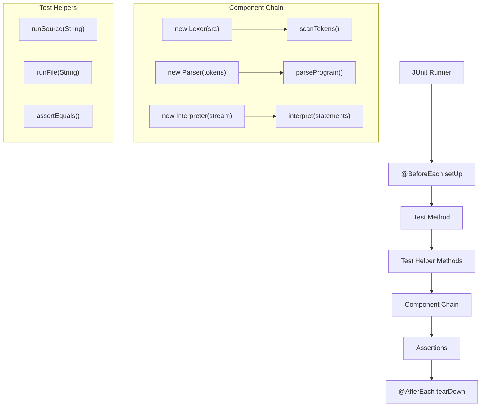
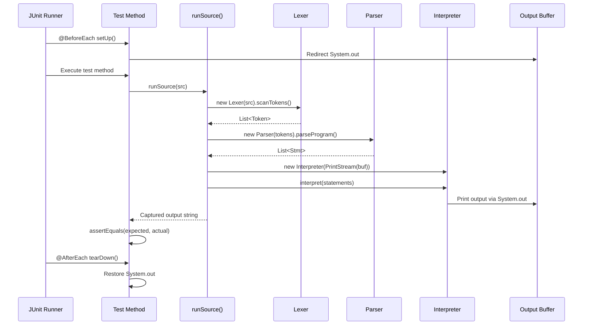
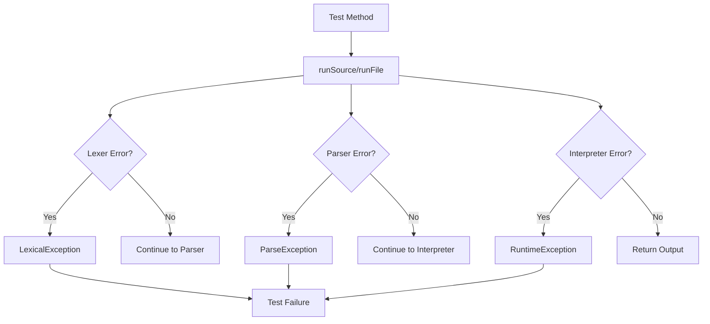
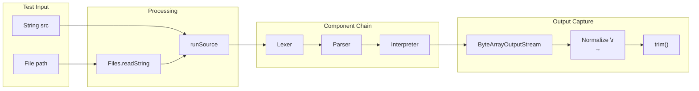
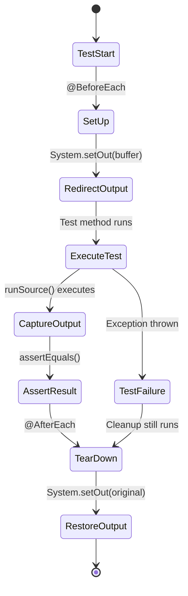

# Testing Functions Reference

**Function-level tracing and call-graph reference for JUnit test implementation in Bisaya++ interpreter**

## Table of Contents
- [Call Graph Overview](#call-graph-overview)
- [Test Infrastructure](#test-infrastructure)
- [Test Helper Functions](#test-helper-functions)
- [Test Method Patterns](#test-method-patterns)
- [Test Execution Flow](#test-execution-flow)
- [Debug Tracing Recipes](#debug-tracing-recipes)
- [Test Data Flow](#test-data-flow)

## Call Graph Overview



## Test Infrastructure

### `@BeforeEach setUp() → void`

**Purpose**: Initialize test environment before each test method execution

**Algorithm**:
```java
@BeforeEach
void setUp() {
    origOut = System.out;                    // 1. Save original output stream
    buf = new ByteArrayOutputStream();       // 2. Create capture buffer
    System.setOut(new PrintStream(buf));     // 3. Redirect System.out to buffer
}
```

**Side Effects**:
- Captures all `System.out` output into `buf`
- Preserves original output stream for restoration
- Enables output testing without console pollution

**Debug Recipe**: Output capture not working?
1. Check `buf` is properly initialized - not null?
2. Verify `System.setOut()` called before test execution
3. Ensure `PrintStream(buf)` wraps `ByteArrayOutputStream` correctly

**Call Flow**:
```
JUnit Runner → @BeforeEach → setUp() → Test Method → Helper Methods → Assertions
```

### `@AfterEach tearDown() → void`

**Purpose**: Restore system state after each test method execution

**Algorithm**:
```java
@AfterEach
void tearDown() {
    System.setOut(origOut);                  // Restore original System.out
}
```

**Side Effects**:
- Restores normal console output behavior
- Prevents test interference between methods
- Cleans up output redirection

**Debug Recipe**: Console output issues after tests?
1. Check `origOut` is not null during teardown
2. Verify `tearDown()` is always called (even on test failure)
3. Ensure no exceptions in teardown prevent restoration

## Test Helper Functions

### `runSource(String src) → String`

**Purpose**: Execute complete Bisaya++ program from source string and return captured output

**Input**: 
- `src`: Bisaya++ source code as multi-line string

**Algorithm**:
```java
private String runSource(String src) {
    List<Token> toks = new Lexer(src).scanTokens();           // 1. Tokenize
    List<Stmt> prog = new Parser(toks).parseProgram();        // 2. Parse AST
    Interpreter interp = new Interpreter(new PrintStream(buf)); // 3. Create interpreter
    interp.interpret(prog);                                    // 4. Execute
    return buf.toString().replace("\r\n", "\n").trim();       // 5. Normalize output
}
```

**Output**: Normalized program output as string (Unix newlines, trimmed)

**Side Effects**:
- Writes to `buf` via interpreter output
- May throw exceptions from lexer, parser, or interpreter
- Modifies interpreter environment state

**Debug Recipe**: `runSource()` not producing expected output?
1. **Step 1 - Tokenization**: Check `toks` list - correct tokens generated?
   ```java
   // Add debugging
   List<Token> toks = new Lexer(src).scanTokens();
   System.err.println("Tokens: " + toks.size());
   for (Token t : toks) System.err.println("  " + t.type + ": " + t.lexeme);
   ```

2. **Step 2 - Parsing**: Check `prog` list - correct AST nodes?
   ```java
   List<Stmt> prog = new Parser(toks).parseProgram();
   System.err.println("Statements: " + prog.size());
   for (Stmt s : prog) System.err.println("  " + s.getClass().getSimpleName());
   ```

3. **Step 3 - Interpretation**: Check interpreter execution - proper output generation?
   ```java
   Interpreter interp = new Interpreter(new PrintStream(buf));
   interp.interpret(prog);
   System.err.println("Raw output: [" + buf.toString() + "]");
   ```

4. **Step 4 - Normalization**: Check final string processing - correct format?
   ```java
   String result = buf.toString().replace("\r\n", "\n").trim();
   System.err.println("Normalized: [" + result + "]");
   ```

**Examples**:
```java
// Simple program execution
String src = "SUGOD\nIPAKITA: \"Hello\"\nKATAPUSAN";
String result = runSource(src);  
// → Lexer → Parser → Interpreter → "Hello"

// Complex program with variables
String src = """
    SUGOD
      MUGNA NUMERO x=5
      IPAKITA: x
    KATAPUSAN
    """;
String result = runSource(src);
// → "5"
```

### `runFile(String rel) → String` 

**Purpose**: Execute Bisaya++ program from file and return captured output

**Input**:
- `rel`: Relative path to `.bpp` file (from project root)

**Algorithm**:
```java
private String runFile(String rel) throws IOException {
    String src = Files.readString(Paths.get(rel));    // 1. Read file content
    return runSource(src);                            // 2. Execute via runSource()
}
```

**Output**: Same as `runSource()` - normalized program output

**Error Handling**: Throws `IOException` if file not found or unreadable

**Debug Recipe**: File execution failing?
1. **File Access**: Check path resolution and file existence
   ```java
   Path path = Paths.get(rel);
   System.err.println("Resolved path: " + path.toAbsolutePath());
   System.err.println("File exists: " + Files.exists(path));
   ```

2. **File Content**: Verify file content matches expected format
   ```java
   String src = Files.readString(Paths.get(rel));
   System.err.println("File content:\n" + src);
   ```

3. **Execution**: Debug via `runSource()` debugging steps

**Usage Examples**:
```java
// Sample file testing
@Test
void sampleHelloFile_runsEndToEnd() throws Exception {
    String out = runFile("samples/hello.bpp");
    assertEquals("Hi, Bisaya++\nBisaya++ Interpreter", out);
}
```

## Test Method Patterns

### Basic Program Structure Tests

**Pattern**: `programMarkersAndComments()`

**Test Flow**:
```java
@Test
void programMarkersAndComments() {
    String src = """
        -- header comment
        SUGOD
          -- inside comment  
          IPAKITA: "A" & $
          IPAKITA: "B"
          -- trailer comment
        KATAPUSAN
        """;
    assertEquals("A\nB", runSource(src));
}
```

**Execution Trace**:
```
Test Method → runSource() → Lexer.scanTokens() → 
[COMMENT, SUGOD, COMMENT, IPAKITA, COLON, STRING, AMPERSAND, DOLLAR, ...] →
Parser.parseProgram() → [Stmt.Print(...), Stmt.Print(...)] →
Interpreter.interpret() → visitPrint() → "A\n" + "B\n" → 
Buffer capture → "A\nB" (trimmed)
```

**Validates**:
- Comment parsing (ignored in token stream)
- Program structure (SUGOD/KATAPUSAN)
- Multiple statement execution
- Output concatenation and newlines

### Variable Declaration and Assignment Tests

**Pattern**: `declarationsAndInit()` 

**Test Flow**:
```java
@Test
void declarationsAndInit() {
    String src = """
        SUGOD
          MUGNA NUMERO x, y, z=5
          MUGNA LETRA ch='c'  
          MUGNA TINUOD t="OO"
          IPAKITA: z & $ & ch & $ & t
        KATAPUSAN
        """;
    assertEquals("5\nc\nOO", runSource(src));
}
```

**Execution Trace**:
```
Test Method → runSource() → Lexer.scanTokens() →
[SUGOD, MUGNA, NUMERO, IDENTIFIER("x"), COMMA, ...] →
Parser.parseProgram() → [Stmt.VarDecl(NUMERO, [x,y,z=5]), Stmt.VarDecl(LETRA, [ch='c']), ...] →
Interpreter.interpret() → 
  visitVarDecl() → env.declare("x", NUMERO, null) →
  visitVarDecl() → env.declare("y", NUMERO, null) → 
  visitVarDecl() → env.declare("z", NUMERO, 5) →
  visitVarDecl() → env.declare("ch", LETRA, 'c') →
  visitVarDecl() → env.declare("t", TINUOD, true) →
  visitPrint() → eval(z) → 5, eval($) → "\n", eval(ch) → 'c', eval($) → "\n", eval(t) → "OO" →
  Output: "5\nc\nOO"
```

**Validates**:
- Multiple variable declarations in one statement
- Type-specific initialization
- Null initialization handling  
- Type coercion (TINUOD → Boolean → Display string)
- Variable access in expressions

### Chained Assignment Tests

**Pattern**: `chainedAssignment()`

**Test Flow**:
```java  
@Test
void chainedAssignment() {
    String src = """
        SUGOD
          MUGNA NUMERO x, y
          x=y=4
          IPAKITA: x & $ & y
        KATAPUSAN
        """;
    assertEquals("4\n4", runSource(src));
}
```

**Execution Trace**:
```
Test Method → runSource() → Parser.parseProgram() →
Stmt.ExprStmt(Expr.Assign("x", Expr.Assign("y", 4))) →
Interpreter.visitExprStmt() → eval(assign_expr) →
  visitAssign("x", assign_expr) →
    eval(Expr.Assign("y", 4)) → visitAssign("y", 4) →
      eval(4) → 4 →
      env.assign("y", 4) → return 4 →
    env.assign("x", 4) → return 4 →
  visitPrint() → "4\n4"
```

**Validates**:
- Right-associative assignment parsing
- Nested assignment evaluation  
- Assignment return value propagation
- Multiple variable updates

### Escape Sequence Tests

**Pattern**: `bracketEscapes_exactSpec()`

**Test Flow**:
```java
@Test
void bracketEscapes_exactSpec() {
    String src = """
        SUGOD
        IPAKITA: [[] & $
        IPAKITA: []]  
        IPAKITA: [&]
        KATAPUSAN
        """;
    assertEquals("[\n]\n&", runSource(src));
}
```

**Execution Trace**:
```
Test Method → runSource() → Lexer.scanTokens() →
Process "[[]" → STRING token with value "[" →
Process "$" → DOLLAR token →  
Process "[]]" → STRING token with value "]" →
Process "[&]" → STRING token with value "&" →
Parser.parseProgram() → [Print([STRING("["), DOLLAR]), Print([STRING("]")]), Print([STRING("&")])] →
Interpreter.interpret() → 
  visitPrint() → stringify("[") + stringify("\n") → "[\n" →
  visitPrint() → stringify("]") + "\n" → "]\n" →  
  visitPrint() → stringify("&") + "\n" → "&\n" →
Final output: "[\n]\n&"
```

**Validates**:
- Bracket escape sequence processing in lexer
- Literal character output (not operators)
- Multiple escape types `[[`, `]]`, `[&]`
- Proper string token generation

## Test Execution Flow

### JUnit Lifecycle Integration



### Error Propagation Flow



## Debug Tracing Recipes

### Trace Complete Test Execution

**Recipe**: Add debugging to `runSource()` for full pipeline visibility

```java
private String runSource(String src) {
    System.err.println("=== DEBUGGING runSource() ===");
    System.err.println("Input source:\n" + src);
    
    // Step 1: Lexical Analysis
    List<Token> toks = new Lexer(src).scanTokens();
    System.err.println("Tokens (" + toks.size() + "):");
    for (int i = 0; i < toks.size(); i++) {
        Token t = toks.get(i);
        System.err.println("  [" + i + "] " + t.type + ": '" + t.lexeme + "'");
    }
    
    // Step 2: Syntax Analysis  
    List<Stmt> prog = new Parser(toks).parseProgram();
    System.err.println("Statements (" + prog.size() + "):");
    for (int i = 0; i < prog.size(); i++) {
        Stmt s = prog.get(i);
        System.err.println("  [" + i + "] " + s.getClass().getSimpleName());
    }
    
    // Step 3: Execution
    Interpreter interp = new Interpreter(new PrintStream(buf));
    System.err.println("Before interpretation, buffer empty: " + buf.toString().isEmpty());
    interp.interpret(prog);
    System.err.println("After interpretation, buffer: '" + buf.toString() + "'");
    
    // Step 4: Output Processing
    String raw = buf.toString();
    String normalized = raw.replace("\r\n", "\n").trim();
    System.err.println("Raw output: [" + raw + "]");
    System.err.println("Normalized: [" + normalized + "]");
    System.err.println("=== END DEBUGGING ===");
    
    return normalized;
}
```

### Trace Specific Component Issues

**Lexer Issues**:
```java
// Add to test method for token debugging
String src = "MUGNA NUMERO x=5";
List<Token> tokens = new Lexer(src).scanTokens();
for (Token t : tokens) {
    System.err.printf("%-12s: '%s'\n", t.type, t.lexeme);
}
// Expected output:
// MUGNA       : 'MUGNA'
// NUMERO      : 'NUMERO'  
// IDENTIFIER  : 'x'
// EQUAL       : '='
// NUMBER      : '5'
// EOF         : ''
```

**Parser Issues**:
```java
// Add to test method for AST debugging  
List<Stmt> statements = new Parser(tokens).parseProgram();
for (int i = 0; i < statements.size(); i++) {
    Stmt s = statements.get(i);
    System.err.println("Statement " + i + ": " + s.getClass().getSimpleName());
    if (s instanceof Stmt.VarDecl vd) {
        System.err.println("  Type: " + vd.type);
        System.err.println("  Items: " + vd.items.size());
    }
}
```

**Interpreter Issues**:
```java
// Add environment inspection
@Test
void debugEnvironmentState() {
    String src = "SUGOD\nMUGNA NUMERO x=5\nx=10\nKATAPUSAN";
    
    // Create interpreter with debug hooks
    Interpreter interp = new Interpreter(new PrintStream(buf));
    // ... add environment inspection after each statement
}
```

### Trace Output Formatting Issues

**Recipe**: Debug string processing and newline handling

```java
@Test  
void debugOutputFormatting() {
    String src = """
        SUGOD
          IPAKITA: "A" & $
          IPAKITA: "B"
        KATAPUSAN
        """;
    
    ByteArrayOutputStream debugBuf = new ByteArrayOutputStream(); 
    Interpreter interp = new Interpreter(new PrintStream(debugBuf));
    // ... run interpreter
    
    String raw = debugBuf.toString();
    System.err.println("Raw bytes: " + java.util.Arrays.toString(raw.getBytes()));
    System.err.println("Raw string: [" + raw + "]");
    System.err.println("Raw length: " + raw.length());
    
    String normalized = raw.replace("\r\n", "\n").trim();
    System.err.println("Normalized: [" + normalized + "]");
    System.err.println("Expected:   [A\nB]");
    System.err.println("Match: " + normalized.equals("A\nB"));
}
```

## Test Data Flow

### Input Processing Pipeline



### State Management Flow



### Memory and Resource Flow

**Setup Phase**:
- `origOut` → References `System.out`
- `buf` → New `ByteArrayOutputStream`
- `System.out` → Redirected to `PrintStream(buf)`

**Execution Phase**:  
- Interpreter writes → `buf` (via redirected `System.out`)
- `buf.toString()` → Captured output string
- String processing → Normalized result

**Cleanup Phase**:
- `System.out` → Restored to `origOut`
- `buf` → Eligible for garbage collection
- Test isolation maintained

---

**Links:**
- Testing Guide: [`testing-guide.md`](./testing-guide.md)
- Interpreter Functions: [`interpreter-functions.md`](./interpreter-functions.md)
- Parser Functions: [`parser-functions.md`](./parser-functions.md)  
- Lexer Functions: [`lexer-functions.md`](./lexer-functions.md)
- Test Source: [`../app/src/test/java/com/bisayapp/Increment1Tests.java`](../app/src/test/java/com/bisayapp/Increment1Tests.java)
