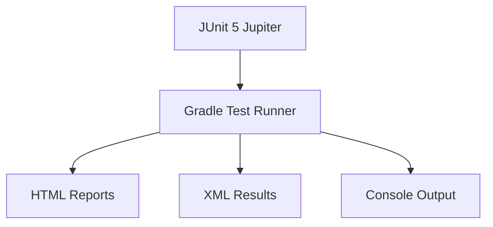
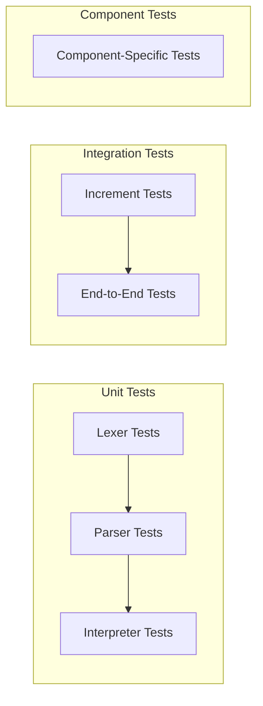
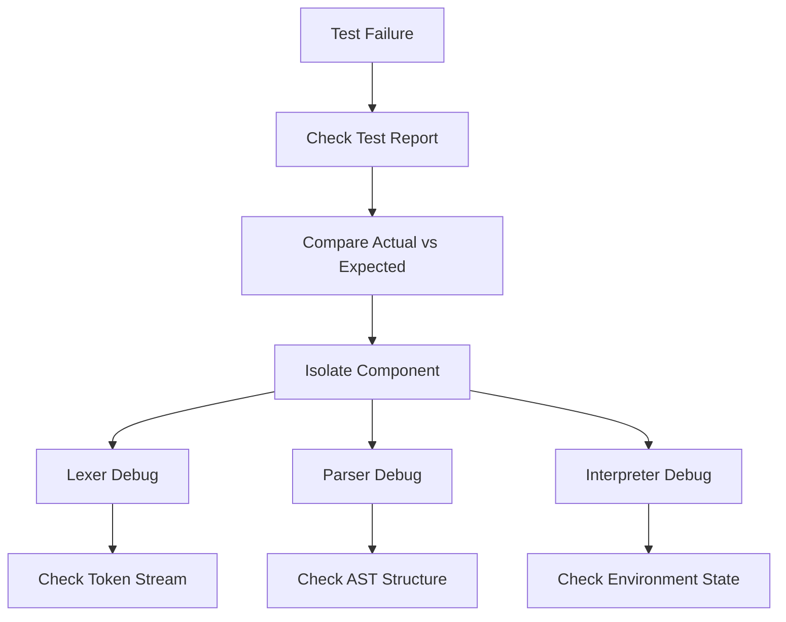

# Bisaya++ Testing Guide

**Comprehensive JUnit 5 testing framework for the Bisaya++ interpreter**

## Table of Contents
- [Overview](#overview)
- [Test Architecture](#test-architecture)
- [Running Tests](#running-tests)
- [Test Suite Reference](#test-suite-reference)
- [Writing New Tests](#writing-new-tests)
- [Debugging Test Failures](#debugging-test-failures)
- [Test Coverage by Increment](#test-coverage-by-increment)
- [Best Practices](#best-practices)

## Overview

The Bisaya++ interpreter uses **JUnit 5 Jupiter** for comprehensive testing across all components. Tests validate lexical analysis, syntax parsing, runtime execution, and end-to-end program behavior.

### Test Philosophy
- **Increment-Driven**: Each increment has dedicated test classes
- **Component-Isolated**: Separate tests for Lexer, Parser, Interpreter
- **Behavior-Focused**: Test language features, not just implementation details
- **Error-Inclusive**: Validate both success and failure scenarios

### Testing Stack


## Test Architecture

### Test Structure Overview
```
app/src/test/java/com/bisayapp/
├── Increment1Tests.java               // End-to-end increment validation
├── LexerTest.java                    // Token recognition & lexical rules
├── ParserTest.java                   // AST construction & grammar validation  
├── InterpreterPrintTest.java         // Output formatting & IPAKITA behavior
├── VarDeclAssignTest.java            // Variable operations & type system
├── ReservedWordsAndIdentifiersTest.java  // Language keyword validation
└── CommentAndNewlineRulesTest.java   // Comment parsing & special tokens
```

### Test Methodology



**Test Layers:**
- **Unit**: Individual component functionality (Lexer, Parser, Interpreter)
- **Integration**: Multi-component workflows (Increment tests)
- **Component**: Feature-specific testing (Variables, Output, Comments)

## Running Tests

### Command Reference

**Run All Tests:**
```bash
./gradlew test
```

**Test by Class:**
```bash
./gradlew test --tests "Increment1Tests"
./gradlew test --tests "LexerTest"
./gradlew test --tests "ParserTest" 
./gradlew test --tests "InterpreterPrintTest"
./gradlew test --tests "VarDeclAssignTest"
./gradlew test --tests "ReservedWordsAndIdentifiersTest"
./gradlew test --tests "CommentAndNewlineRulesTest"
```

**Test by Pattern:**
```bash
./gradlew test --tests "*Increment*"    # All increment tests
./gradlew test --tests "*Lexer*"        # All lexer tests  
./gradlew test --tests "*Parser*"       # All parser tests
./gradlew test --tests "*Interpreter*"  # All interpreter tests
```

**Specific Test Method:**
```bash
./gradlew test --tests "Increment1Tests.programMarkersAndComments"
./gradlew test --tests "LexerTest.identifiers_follow_spec_rule"
```

**Verbose Output:**
```bash
./gradlew test --info    # Detailed test execution info
./gradlew test -i        # Short form
```

### Test Reports

**HTML Report** (Recommended for instructors):
```
app/build/reports/tests/test/index.html
```
- Visual test results with pass/fail status
- Test execution times and stack traces
- Organized by test class and method

**XML Results** (CI/CD integration):
```
app/build/test-results/test/
├── TEST-com.bisayapp.Increment1Tests.xml
├── TEST-com.bisayapp.LexerTest.xml
└── ...
```

**Console Output:**
- Real-time test execution status
- Immediate feedback on failures
- Summary statistics

## Test Suite Reference

### Increment1Tests.java - **End-to-End Validation**

**Purpose**: Validate complete Increment 1 features through full program execution

**Key Test Categories:**

| Test Method | Validates | Sample Input |
|-------------|-----------|--------------|
| `programMarkersAndComments()` | SUGOD/KATAPUSAN + comments | `-- comment\nSUGOD\n...\nKATAPUSAN` |
| `printConcatAndDollar()` | IPAKITA with & and $ | `IPAKITA: "num=" & 7 & $` |
| `declarationsAndInit()` | MUGNA with types | `MUGNA NUMERO x=5` |
| `chainedAssignment()` | Assignment chaining | `x = y = 4` |
| `escapeSequencesInPrint()` | Bracket escapes | `IPAKITA: [&] & "text"` |

**Test Helper Pattern:**
```java
private String runSource(String src) {
    List<Token> toks = new Lexer(src).scanTokens();
    List<Stmt> prog = new Parser(toks).parseProgram();
    Interpreter interp = new Interpreter(new PrintStream(buf));
    interp.interpret(prog);
    return buf.toString().replace("\r\n", "\n").trim();
}
```

### LexerTest.java - **Token Recognition**

**Purpose**: Validate lexical analysis and tokenization rules

**Key Test Categories:**

| Test Method | Validates | Expected Tokens |
|-------------|-----------|-----------------|
| `programMarkers_and_Newline()` | Basic keywords | `SUGOD`, `KATAPUSAN`, `EOF` |
| `comments_are_ignored_until_eol()` | Comment handling | No comment tokens produced |
| `concat_and_dollar_as_operand()` | Special operators | `AMPERSAND`, `DOLLAR` |
| `bracket_escapes_to_string_token()` | Escape sequences | `STRING` tokens with literal content |
| `identifiers_follow_spec_rule()` | Variable naming | Valid: `a_1`, `_x`, `y9` |

**Token Validation Pattern:**
```java
private List<Token> lex(String src) {
    return new Lexer(src).scanTokens();
}

@Test
void comments_are_ignored_until_eol() {
    var toks = lex("SUGOD\n-- comment here\nKATAPUSAN\n");
    assertTrue(toks.stream().anyMatch(t -> t.type == TokenType.SUGOD));
    // No token produced for comment body
}
```

### ParserTest.java - **AST Construction**

**Purpose**: Validate syntax parsing and AST node creation

**Key Test Categories:**

| Test Method | Validates | AST Nodes |
|-------------|-----------|-----------|
| `one_statement_per_line_enforced()` | Statement parsing | Multiple `Stmt` objects |
| `print_with_concat_and_dollar()` | Expression parsing | `Stmt.Print` with concat expressions |
| `var_decl_with_types_and_optional_init()` | Declaration parsing | `Stmt.VarDecl` nodes |
| `assignment_creates_proper_ast()` | Assignment expressions | `Expr.Assign` nodes |

**AST Validation Pattern:**
```java
private List<Stmt> parse(String src) { 
    return new Parser(lex(src)).parseProgram(); 
}

@Test
void var_decl_with_types_and_optional_init() {
    String src = "SUGOD\nMUGNA NUMERO x=5\nKATAPUSAN";
    var prog = parse(src);
    long varDecls = prog.stream()
        .filter(s -> s instanceof Stmt.VarDecl)
        .count();
    assertTrue(varDecls >= 1);
}
```

### InterpreterPrintTest.java - **Output Behavior**

**Purpose**: Validate IPAKITA command execution and output formatting

**Key Features:**
- String concatenation with `&` operator
- Newline handling with `$` token
- Escape sequence processing `[&]`, `[[]`, `[]]]`
- Type-specific output formatting

### VarDeclAssignTest.java - **Variable Operations**

**Purpose**: Validate variable declaration, assignment, and type system

**Key Test Categories:**

| Test Method | Validates | Data Types |
|-------------|-----------|------------|
| `numero_tipik_letra_tinuod_assignment_and_print()` | All basic types | `NUMERO`, `TIPIK`, `LETRA`, `TINUOD` |
| `chained_assignment_right_associative_and_print()` | Assignment chains | `x = y = 4` |
| `type_coercion_behavior()` | Type conversion | String→Number, Boolean→String |

### ReservedWordsAndIdentifiersTest.java - **Language Rules**

**Purpose**: Validate reserved word restrictions and identifier rules

**Validates:**
- Reserved words cannot be used as variable names
- Identifier naming conventions (`letter|_` followed by `letter|digit|_`)
- Case sensitivity in identifiers

### CommentAndNewlineRulesTest.java - **Lexical Edge Cases**

**Purpose**: Validate comment parsing and special token handling

**Validates:**
- `--` comments to end-of-line
- `$` token as newline operator
- Mixed comment and code scenarios

## Writing New Tests

### Test Class Template

```java
package com.bisayapp;

import static org.junit.jupiter.api.Assertions.*;
import org.junit.jupiter.api.*;
import java.io.*;

public class NewFeatureTest {
    
    private PrintStream origOut;
    private ByteArrayOutputStream buf;

    @BeforeEach
    void setUp() {
        origOut = System.out;
        buf = new ByteArrayOutputStream();
        System.setOut(new PrintStream(buf));
    }

    @AfterEach
    void tearDown() {
        System.setOut(origOut);
    }

    private String runSource(String src) {
        List<Token> toks = new Lexer(src).scanTokens();
        List<Stmt> prog = new Parser(toks).parseProgram();
        Interpreter interp = new Interpreter(new PrintStream(buf));
        interp.interpret(prog);
        return buf.toString().replace("\r\n", "\n").trim();
    }

    @Test 
    void testNewFeature() {
        String src = """
            SUGOD
              -- test code here
            KATAPUSAN
            """;
        String expected = "expected output";
        assertEquals(expected, runSource(src));
    }
}
```

### Test Naming Conventions

**Method Names**: Use descriptive, behavior-focused names
```java
// Good
@Test void chained_assignment_right_associative()
@Test void reserved_words_cannot_be_identifiers()
@Test void tinuod_variables_display_bisaya_literals()

// Avoid
@Test void test1()
@Test void assignmentTest()
```

**Test Categories**: Group by feature/increment
```java
// ---- Variable Declaration Tests ----
@Test void mugna_numero_with_initializer()
@Test void mugna_letra_without_initializer()

// ---- IPAKITA Output Tests ----  
@Test void ipakita_simple_string()
@Test void ipakita_concatenation_with_ampersand()
```

### Assertion Patterns

**String Output Validation:**
```java
assertEquals("expected output", runSource(src));
assertTrue(output.contains("partial match"));
assertFalse(output.contains("should not appear"));
```

**Token Validation:**
```java
var tokens = new Lexer(src).scanTokens();
assertEquals(TokenType.SUGOD, tokens.get(0).type);
assertTrue(tokens.stream().anyMatch(t -> t.type == TokenType.IDENTIFIER));
```

**AST Validation:**
```java
var statements = new Parser(tokens).parseProgram();
assertTrue(statements.get(0) instanceof Stmt.VarDecl);
assertEquals("x", ((Stmt.VarDecl)statements.get(0)).items.get(0).name);
```

**Exception Testing:**
```java
assertThrows(RuntimeException.class, () -> {
    runSource("SUGOD\nundefined_var\nKATAPUSAN");
});
```

## Debugging Test Failures

### Common Failure Patterns

**Test Output Doesn't Match Expected:**
```bash
# Check actual vs expected output
./gradlew test --tests "Increment1Tests.printConcatAndDollar" --info
```

**Debug Steps:**
1. **Inspect Actual Output**: Check test report or add `System.err.println(actual)`
2. **Verify Input**: Ensure test source code matches intent
3. **Component Isolation**: Test lexer → parser → interpreter separately
4. **Cross-Reference**: Check function docs for expected behavior

### Debugging Workflow



### Debug Helper Methods

**Add to Test Classes:**
```java
private void debugTokens(String src) {
    var tokens = new Lexer(src).scanTokens();
    for (var token : tokens) {
        System.err.println(token.type + ": " + token.lexeme);
    }
}

private void debugAST(String src) {
    var tokens = new Lexer(src).scanTokens(); 
    var statements = new Parser(tokens).parseProgram();
    for (var stmt : statements) {
        System.err.println(stmt.getClass().getSimpleName());
    }
}
```

### IDE Integration

**IntelliJ IDEA:**
- Right-click test method → "Debug Test"
- Set breakpoints in test and implementation code
- Use "Evaluate Expression" for runtime inspection

**VS Code:**
- Install "Extension Pack for Java"
- Use "Run" and "Debug" code lenses
- Integrated terminal for gradle commands

## Test Coverage by Increment

### Increment 1 Coverage ✅

**Features Tested:**
- [x] Program structure (SUGOD/KATAPUSAN)
- [x] Comments (-- to end-of-line)  
- [x] Variable declaration (MUGNA with types)
- [x] Variable assignment (including chains)
- [x] String concatenation (&)
- [x] Output command (IPAKITA)
- [x] Escape sequences ([&], [[], []]])
- [x] Special tokens ($ for newline)
- [x] Reserved word enforcement
- [x] Type system (NUMERO, LETRA, TINUOD, TIPIK)

**Test Files:** `Increment1Tests`, `LexerTest`, `ParserTest`, `VarDeclAssignTest`

### Increment 2 Coverage 🔄

**Features to Test:**
- [ ] Unary operators (+, -, ++, --)
- [ ] Input command (DAWAT)  
- [ ] Arithmetic operations (+, -, *, /, %)
- [ ] Comparison operators (>, <, >=, <=, ==, <>)
- [ ] Logical operations (UG, O, DILI)
- [ ] Boolean literals ("OO", "DILI")

**Recommended Test Files:**
- `Increment2Tests.java` - End-to-end increment validation
- `ArithmeticOperatorsTest.java` - Math operations
- `LogicalOperatorsTest.java` - Boolean logic
- `InputOutputTest.java` - DAWAT command testing

### Increment 3 Coverage 🔄

**Features to Test:**
- [ ] KUNG (if) statements
- [ ] KUNG-KUNG WALA (if-else)
- [ ] KUNG-KUNG DILI (if-else if)
- [ ] PUNDOK{} block structures
- [ ] Nested conditionals
- [ ] Boolean expression evaluation

### Increment 4 Coverage 🔄

**Features to Test:**
- [ ] WHILE loops
- [ ] Nested loops
- [ ] Loop termination conditions
- [ ] Variable scope in loops

## Best Practices

### Test Organization

**1. One Test Class per Component/Feature:**
```
LexerTest.java          // Lexical analysis
ParserTest.java         // Syntax parsing  
InterpreterTest.java    // Runtime execution
IncrementNTests.java    // End-to-end feature validation
```

**2. Descriptive Test Methods:**
```java
@Test void reserved_words_cannot_be_variable_names()
@Test void chained_assignment_evaluates_right_to_left()
@Test void ipakita_uses_dollar_sign_for_explicit_newlines()
```

**3. Clear Test Data:**
```java
// Use text blocks for multi-line source
String src = """
    SUGOD
      MUGNA NUMERO x=5
      IPAKITA: x
    KATAPUSAN
    """;
```

### Test Quality Guidelines

**✅ Good Practices:**
- Test behavior, not implementation
- Use meaningful assertions with custom messages
- Group related tests with comments
- Include both positive and negative test cases
- Use setup/teardown for common test infrastructure

**❌ Avoid:**
- Testing private methods directly
- Overly complex test logic
- Hard-coded magic numbers without context
- Tests that depend on execution order
- Ignoring test failures without investigation

### Continuous Testing Workflow

**During Development:**
```bash
# Quick feedback loop
./gradlew test --tests "Increment1Tests" --continuous

# Full validation before commit
./gradlew test
```

**Before Push:**
```bash
# Clean build with full test suite
./gradlew clean test
```

### Test Documentation

**Document Complex Test Scenarios:**
```java
@Test 
void chained_assignment_with_type_coercion() {
    // Test validates that chained assignment (x = y = value)
    // properly handles type coercion when variables have
    // declared types that differ from the assigned value type
    String src = """
        SUGOD
          MUGNA NUMERO x
          MUGNA TIPIK y  
          x = y = 3.14  // Should coerce 3.14 to 3 for x, keep as 3.14 for y
        KATAPUSAN
        """;
    // ... test implementation
}
```

---

**Links:**
- Main Documentation: [`README.md`](./README.md)
- Interpreter Functions: [`interpreter-functions.md`](./interpreter-functions.md)
- Source Code Tests: [`../app/src/test/java/com/bisayapp/`](../app/src/test/java/com/bisayapp/)
- Build Configuration: [`../app/build.gradle`](../app/build.gradle)
